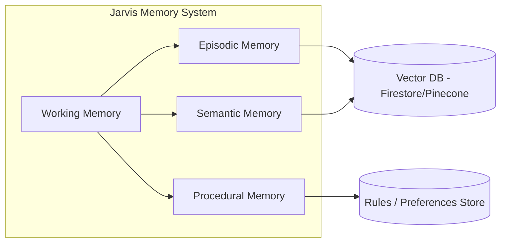
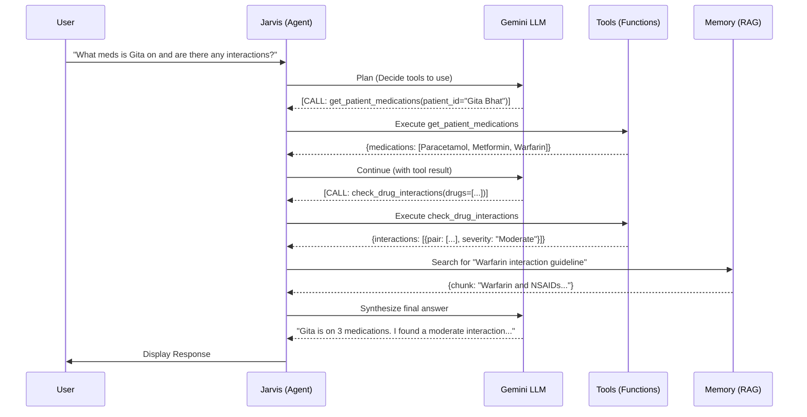

# Jarvis 2.0: The Super Agent Master Plan

> **Goal:** Transform Jarvis from a simple chatbot into the smartest AI clinical assistant in the world—one that *remembers everything*, *reasons deeply*, *acts proactively*, and is *always aware*.

---

## 1. Philosophical Foundation: What Makes a "Super Agent"?

A truly intelligent agent isn't just an LLM. It's an **Autonomous System** with:

| Capability | Current Jarvis | Jarvis 2.0 (Target) |
|---|---|---|
| **Memory** | Session-only context window | Persistent: Semantic, Episodic, Procedural |
| **Reasoning** | Single-turn Q&A | Multi-step Chain-of-Thought + Self-Reflection |
| **Tool Use** | None (pure prompt) | Function Calling (Read/Write Data, MCP) |
| **Proactivity** | Reactive only | Proactive Insights & Notifications |
| **Coherence** | Loses context on refresh | Full persistence across sessions |
| **Knowledge** | Inside model weights | External RAG (Guidelines, Protocols, Formulary) |

---

## 2. The Multi-Tiered Memory Architecture (The Brain)

This is the core innovation. Jarvis must remember like a human.



### 2.1 Working Memory (Short-Term)
*   **What:** The current conversation buffer + currently viewed patient context.
*   **Lifetime:** Single session.
*   **Impl:** Already exists in `JarvisGlobalProvider.tsx`.

### 2.2 Episodic Memory (Long-Term Recall)
*   **What:** Specific past events. *"Remember when we discussed Mrs. Patel's sepsis on Jan 5th?"*
*   **Lifetime:** Persistent (Firestore/Vector DB).
*   **Impl:**
    1.  After each significant conversation turn, embed the `(patient_id, summary, timestamp, outcome)` tuple.
    2.  Store embedding + metadata in a vector store.
    3.  On new query, retrieve top-K relevant past episodes.

### 2.3 Semantic Memory (Knowledge Base RAG)
*   **What:** Facts and knowledge. Medical guidelines (NICE, UpToDate), Hospital Formulary, Drug Interactions.
*   **Lifetime:** Persistent (updated periodically by admin).
*   **Impl:**
    1.  Ingest PDFs/Docs via chunking + embedding.
    2.  Store in Pinecone/Chroma/Firestore Vector.
    3.  Use **Agentic RAG**: Jarvis *decides* when to search the KB vs. use its own knowledge.

### 2.4 Procedural Memory (Doctor Preferences)
*   **What:** The doctor's habits and workflow preferences. *"Dr. S always orders a CBC and CRP for fever."*
*   **Lifetime:** Persistent (Firestore).
*   **Impl:**
    1.  Track `(action_type, context_trigger, accepted/rejected)`.
    2.  Build a preference model per doctor.
    3.  Use this to personalize suggestions.

---

## 3. The Agent Loop (The Engine)

Jarvis must be able to **think**, **act**, and **reflect**.



### 3.1 Core Loop Implementation (ReAct Pattern)
1.  **Receive Query:** User input + current context (patient, screen).
2.  **Think:** LLM reasons about what to do via Chain-of-Thought.
3.  **Act:** LLM calls one or more Gemini Function Calls (tools).
4.  **Observe:** Jarvis executes tools and feeds results back.
5.  **Reflect:** LLM decides if goal is met or if more actions are needed.
6.  **Respond:** Synthesize final answer for the doctor.

### 3.2 Toolset (The Hands)
Define these as Gemini Function Declarations:

| Tool Name | Description | Example Use |
|---|---|---|
| `get_patient_summary` | Fetches structured summary of a patient | "Summarize Gita Bhat" |
| `get_patient_vitals_history` | Returns last N vital records | "Show me Gita's last 3 vitals" |
| `get_patient_medications` | Lists current meds | "What drugs is she on?" |
| `get_patient_orders` | Fetches pending/completed orders | "Any pending labs?" |
| `check_drug_interactions` | Checks for interactions (external API or KB) | "Is Warfarin safe with her other meds?" |
| `search_knowledge_base` | RAG query over medical guidelines | "What is the qSOFA criteria for sepsis?" |
| `add_order` | Drafts a new order for the patient | "Order a CBC for Gita" |
| `create_note` | Drafts a clinical note | "Note: Discussed risks of procedure." |
| `search_patients` | Find patients by name/criteria | "Who are my critical patients?" |
| `get_ops_metrics` | Fetches dashboard KPIs | "What's the bed occupancy?" |

---

## 4. Proactive Intelligence (The Conscience)

Jarvis shouldn't just wait to be asked. It should *think ahead*.

### 4.1 Background Workers
*   **Vitals Watcher:** On new vitals, run CDS rules silently. If alert fires, push notification to Jarvis.
*   **Order Tracker:** If an order is pending >24h, proactively notify.
*   **Discharge Planner:** If patient is medically stable + LOS > avg, suggest discharge review.

### 4.2 Proactive Nudges (UI)
*   **Context-Aware Chips:** When viewing a patient, show actionable chips based on state:
    *   `🔬 Labs pending > 12h` → Click to re-order.
    *   `💊 Interaction Alert: Warfarin + Ibuprofen` → Click to review.
*   **Morning Briefing 2.0:** On login, Jarvis summarizes the day *based on real-time data*, not just patient count.

---

## 5. Omnipresence (The Eyes)

Jarvis must know *where* the doctor is in the app and adapt.

### 5.1 Context Sync
*   **Global State:** `JarvisGlobalProvider` already handles this.
*   **Enhancement:** Auto-sync not just `currentPatient`, but also `currentScreen` (e.g., 'vitals', 'orders', 'ops-dashboard').
*   **Benefit:** Jarvis can offer screen-specific help. *"I see you're on the Ops Dashboard. Would you like me to summarize the TPA backlog?"*

### 5.2 Voice Integration (Future)
*   Use Web Speech API for voice-to-text and TTS for voice output.
*   Allow doctors to interact hands-free during rounds.

---

## 6. Proposed File Structure

```
services/
└── jarvis/
    ├── agent/
    │   ├── AgentLoop.ts           # The core ReAct loop
    │   ├── ToolRegistry.ts        # Defines all available tools
    │   └── Planner.ts             # Decides which tools to use
    ├── memory/
    │   ├── WorkingMemory.ts       # Session context buffer
    │   ├── EpisodicMemory.ts      # Past interactions (Vector Store)
    │   ├── SemanticMemory.ts      # Knowledge Base RAG
    │   └── ProceduralMemory.ts    # Doctor preferences
    ├── tools/
    │   ├── patientTools.ts        # get_patient_*, add_order, create_note
    │   ├── knowledgeTools.ts      # search_knowledge_base, check_interactions
    │   └── opsTools.ts            # get_ops_metrics, search_patients
    ├── proactive/
    │   ├── VitalsWatcher.ts       # Background CDS listener
    │   └── InsightGenerator.ts    # Creates proactive insights
    └── JarvisGlobalProvider.tsx   # (Existing, enhanced)
```

---

## 7. Implementation Phasing

| Phase | Scope | Deliverables | Effort |
|---|---|---|---|
| **Phase 1: Tool Use** | Implement Gemini Function Calling with 5 core tools. | `AgentLoop.ts`, `ToolRegistry.ts`, `patientTools.ts` | 3-4 days |
| **Phase 2: Episodic Memory** | Persist conversation summaries to Firestore. Retrieve relevant past context. | `EpisodicMemory.ts`, Firestore schema | 2-3 days |
| **Phase 3: Knowledge Base RAG** | Ingest hospital protocols. Implement `search_knowledge_base` tool. | `SemanticMemory.ts`, Vector index, Ingestion script | 3-4 days |
| **Phase 4: Proactive Insights** | Background workers for vitals/orders. UI nudges. | `VitalsWatcher.ts`, `InsightGenerator.ts` | 2-3 days |
| **Phase 5: Procedural Memory** | Track doctor preferences. Personalize suggestions. | `ProceduralMemory.ts`, Preference model | 2 days |

---

## 8. User Review Required

> [!IMPORTANT]
> This is an **ambitious rewrite** of the AI layer. Before proceeding, please confirm:
> 1.  **Backend Choice:** Do you want to use Firebase/Firestore for all persistence, or introduce a dedicated vector DB (Pinecone, Chroma)?
> 2.  **Knowledge Base Source:** What medical guidelines/protocols should Jarvis know? (e.g., UpToDate summaries, hospital SOPs, drug formulary)
> 3.  **Phasing Priority:** Which phase is most critical to start with? (I recommend Phase 1: Tool Use as it unblocks the agent loop).
> 4.  **Voice Integration:** Is this a near-term requirement or future scope?

---

## 9. Conclusion

This plan transforms Jarvis from a reactive Q&A bot into a **true AI Agent**:
*   **Memory:** Remembers everything—patients, past interactions, doctor preferences.
*   **Reasoning:** Multi-step planning with tool use and self-reflection.
*   **Proactivity:** Surfaces insights before being asked.
*   **Omnipresence:** Adapts to the doctor's current context.

This is the architecture behind the most advanced clinical AI assistants in 2025.
