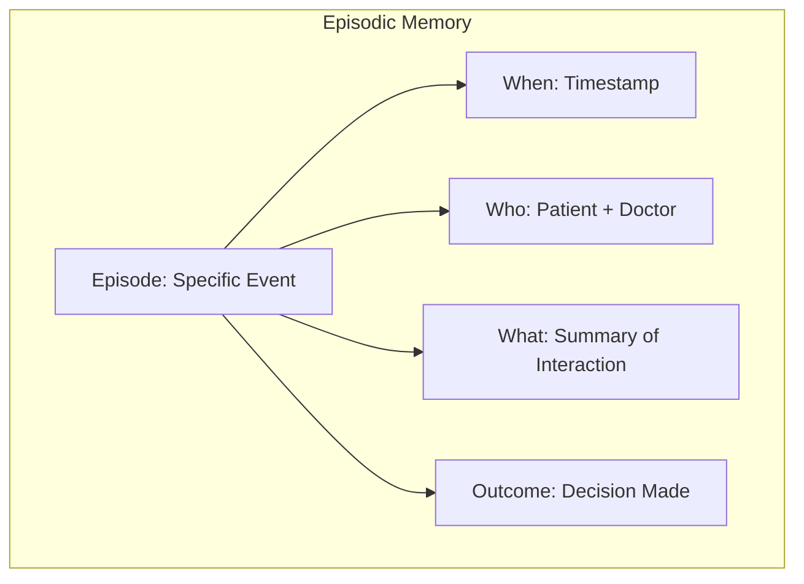

# Phase 2: Episodic Memory — ULTRATHINK Implementation Plan

> **Objective:** Give Jarvis persistent memory of past interactions so it can recall specific patient encounters, learn from previous decisions, and provide continuity across sessions.

---

## 1. Executive Summary

| Attribute | Value |
|---|---|
| **Scope** | Implement long-term memory for patient encounters and conversations |
| **Dependencies** | Phase 1 (Tool Use), Firestore (existing) |
| **New Files** | 4 new TypeScript files |
| **Modified Files** | 2 existing files |
| **Estimated Effort** | 2-3 days |
| **Risk Level** | Medium (PII handling, storage costs) |

---

## 2. ULTRATHINK: Why Episodic Memory Matters

### 2.1 The Problem with Stateless AI

| Scenario | Current Jarvis | Jarvis with Episodic Memory |
|---|---|---|
| "Remember when we discussed Mrs. Patel's sepsis?" | ❌ "I don't have access to past conversations." | ✅ "Yes, on Jan 5th you suspected sepsis based on qSOFA. She responded well to antibiotics." |
| "What did I decide last time for similar cases?" | ❌ No learning | ✅ "In 3 similar cases, you ordered Blood Cultures + Lactate first." |
| Patient returns after 6 months | ❌ No history | ✅ "This patient was here in July for similar symptoms. Last time..." |

### 2.2 Memory Types (Cognitive Science)



**Episodic = "I remember when..."** (specific events, not facts)

---

## 3. Architectural Deep Dive

### 3.1 Storage Strategy Decision

| Option | Pros | Cons | Decision |
|---|---|---|---|
| **A: Firestore (Text Only)** | Simple, existing infra, free tier | No semantic search | ❌ |
| **B: Firestore + Embeddings** | Unified backend, offline persistence | Manual embedding logic | ✅ **Selected** |
| **C: Pinecone/Chroma** | Optimized vector search | Extra service, cost, latency | ❌ (Future Phase 3) |

**Rationale:** Keep the stack simple. Firestore can store embeddings as arrays and we can compute cosine similarity client-side for small-to-medium memory sizes (<1000 episodes). For scale, Phase 3 introduces dedicated vector DB.

### 3.2 Embedding Model Selection (ULTRATHINK)

| Model | Dimension | Medical Accuracy | Cost | Decision |
|---|---|---|---|---|
| `text-embedding-004` (Google) | 768 | Good | Free with Gemini | ✅ **Selected** |
| OpenAI `ada-002` | 1536 | Good | $0.0001/1K tokens | ❌ Extra dependency |
| `MedCPT` / `PubMedBERT` | 768 | Excellent | Self-hosted | ❌ Phase 3 (RAG) |

**Rationale:** Use Google's embedding model for consistency with Gemini. Medical-specific embeddings deferred to Phase 3 where document ingestion justifies complexity.

---

## 4. Data Model Design

### 4.1 Episode Schema

```typescript
interface Episode {
    // Identity
    episodeId: string;           // UUID: `EP-{timestamp}-{random}`
    
    // Context
    patientId: string;           // Hashed/De-identified
    patientName: string;         // Stored for display (NOT in embedding)
    doctorId: string;
    
    // Temporal
    timestamp: string;           // ISO 8601
    sessionId: string;           // Groups related turns
    
    // Content (What happened)
    summary: string;             // Human-readable: "Discussed sepsis risk, ordered CBC..."
    userQuery: string;           // The doctor's original question
    jarvisResponse: string;      // What Jarvis said
    toolsUsed: string[];         // ['get_patient_vitals', 'check_drug_interactions']
    outcome?: 'accepted' | 'rejected' | 'modified' | 'none';
    
    // Vector (For Retrieval)
    embedding: number[];         // 768-dim vector
    
    // Metadata
    tags: string[];              // ['sepsis', 'fever', 'CBC']
    confidence: number;          // 0-1 (from agent response)
}
```

### 4.2 Firestore Collection Structure

```
firestore/
└── jarvis_memory/
    └── {doctorId}/
        └── episodes/
            └── {episodeId}: Episode
```

**Why per-doctor?** Procedural memory must be isolated. Dr. A's preferences should not influence Dr. B.

---

## 5. De-Identification Strategy (HIPAA Compliance)

### 5.1 The Problem

Storing `"Patient John Doe, MRN 12345, has sepsis"` in a vector database = HIPAA violation risk.

### 5.2 The Solution: Embed Semantics, Not PII

| Field | Stored in Firestore | Included in Embedding |
|---|---|---|
| `patientName` | ✅ Yes (for display) | ❌ **NO** |
| `patientId` | ✅ Yes (hashed) | ❌ **NO** |
| `summary` (clinical) | ✅ Yes | ✅ Yes (de-identified) |
| `userQuery` | ✅ Yes | ✅ Yes (de-identified) |
| `toolsUsed` | ✅ Yes | ✅ Yes |

### 5.3 De-Identification Function

```typescript
function deidentifyForEmbedding(text: string, patientName: string): string {
    // Replace patient name with [PATIENT]
    let deidentified = text.replace(new RegExp(patientName, 'gi'), '[PATIENT]');
    
    // Replace MRN patterns
    deidentified = deidentified.replace(/\b(MRN|ID)[\s:]*[\w-]+/gi, '[MRN]');
    
    // Replace phone numbers
    deidentified = deidentified.replace(/\+?\d{10,}/g, '[PHONE]');
    
    // Replace dates (keep relative: "yesterday", "3 days ago")
    deidentified = deidentified.replace(/\d{1,2}[\/\-]\d{1,2}[\/\-]\d{2,4}/g, '[DATE]');
    
    return deidentified;
}
```

---

## 6. File-Level Implementation Plan

### 6.1 New Files

```
services/
└── jarvis/
    └── memory/
        ├── EpisodicMemory.ts     # Main memory service
        ├── EmbeddingService.ts   # Generate embeddings via Gemini
        ├── MemoryRetrieval.ts    # Semantic search over episodes
        └── types.ts              # Episode types
```

---

### 6.2 Detailed File Specifications

#### **File 1: `services/jarvis/memory/types.ts`**

```typescript
export interface Episode {
    episodeId: string;
    patientId: string;           // Hashed
    patientName: string;         // Display only
    doctorId: string;
    timestamp: string;
    sessionId: string;
    summary: string;
    userQuery: string;
    jarvisResponse: string;
    toolsUsed: string[];
    outcome?: 'accepted' | 'rejected' | 'modified' | 'none';
    embedding: number[];
    tags: string[];
    confidence: number;
}

export interface MemorySearchResult {
    episode: Episode;
    similarity: number;  // 0-1, cosine similarity
}

export interface MemoryConfig {
    enabled: boolean;
    maxEpisodesToRetrieve: number;
    similarityThreshold: number;  // Only return if similarity > threshold
    retentionDays: number;        // Auto-delete after N days (HIPAA)
}
```

---

#### **File 2: `services/jarvis/memory/EmbeddingService.ts`**

```typescript
import { GoogleGenAI } from '@google/genai';

const ai = new GoogleGenAI({ apiKey: import.meta.env.VITE_GEMINI_API_KEY || 'mock-key' });

const EMBEDDING_MODEL = 'text-embedding-004';

export async function generateEmbedding(text: string): Promise<number[]> {
    try {
        const result = await ai.models.embedContent({
            model: EMBEDDING_MODEL,
            content: text,
        });
        
        return result.embedding || [];
    } catch (error) {
        console.error('[EmbeddingService] Error generating embedding:', error);
        return [];
    }
}

export function cosineSimilarity(a: number[], b: number[]): number {
    if (a.length !== b.length || a.length === 0) return 0;
    
    let dotProduct = 0;
    let normA = 0;
    let normB = 0;
    
    for (let i = 0; i < a.length; i++) {
        dotProduct += a[i] * b[i];
        normA += a[i] * a[i];
        normB += b[i] * b[i];
    }
    
    return dotProduct / (Math.sqrt(normA) * Math.sqrt(normB));
}
```

---

#### **File 3: `services/jarvis/memory/EpisodicMemory.ts`**

```typescript
import { db, isFirebaseInitialized } from '../../firebase';
import { collection, addDoc, query, where, orderBy, limit, getDocs, deleteDoc, doc } from 'firebase/firestore';
import { Episode, MemoryConfig } from './types';
import { generateEmbedding } from './EmbeddingService';

const DEFAULT_CONFIG: MemoryConfig = {
    enabled: import.meta.env.VITE_JARVIS_MEMORY_ENABLED !== 'false',
    maxEpisodesToRetrieve: 5,
    similarityThreshold: 0.7,
    retentionDays: 90,  // 3 months
};

// De-identify text before embedding (HIPAA compliance)
function deidentify(text: string, patientName: string): string {
    let result = text.replace(new RegExp(patientName, 'gi'), '[PATIENT]');
    result = result.replace(/\b(MRN|ID)[\s:]*[\w-]+/gi, '[MRN]');
    result = result.replace(/\+?\d{10,}/g, '[PHONE]');
    return result;
}

// Generate summary from interaction for embedding
function generateEpisodeSummary(
    userQuery: string,
    jarvisResponse: string,
    toolsUsed: string[]
): string {
    const tools = toolsUsed.length > 0 ? ` Used tools: ${toolsUsed.join(', ')}.` : '';
    return `Doctor asked: "${userQuery}" Jarvis responded about clinical assessment.${tools}`;
}

// Extract tags from interaction
function extractTags(text: string): string[] {
    const medicalTerms = [
        'sepsis', 'fever', 'infection', 'diabetes', 'hypertension', 'cardiac',
        'respiratory', 'renal', 'hepatic', 'neurological', 'CBC', 'electrolytes',
        'imaging', 'CT', 'MRI', 'X-ray', 'ECG', 'discharge', 'admission'
    ];
    
    const lower = text.toLowerCase();
    return medicalTerms.filter(term => lower.includes(term));
}

export async function saveEpisode(
    doctorId: string,
    patientId: string,
    patientName: string,
    userQuery: string,
    jarvisResponse: string,
    toolsUsed: string[],
    confidence: number,
    sessionId: string
): Promise<string | null> {
    if (!DEFAULT_CONFIG.enabled || !isFirebaseInitialized || !db) {
        console.log('[EpisodicMemory] Memory disabled or Firebase not initialized');
        return null;
    }
    
    try {
        // De-identify and generate summary
        const deidentifiedQuery = deidentify(userQuery, patientName);
        const deidentifiedResponse = deidentify(jarvisResponse, patientName);
        const summary = generateEpisodeSummary(deidentifiedQuery, deidentifiedResponse, toolsUsed);
        
        // Generate embedding from de-identified content
        const textForEmbedding = `${deidentifiedQuery} ${summary}`;
        const embedding = await generateEmbedding(textForEmbedding);
        
        if (embedding.length === 0) {
            console.warn('[EpisodicMemory] Failed to generate embedding');
            return null;
        }
        
        const episode: Omit<Episode, 'episodeId'> = {
            patientId: hashPatientId(patientId),
            patientName,  // Stored for display, NOT in embedding
            doctorId,
            timestamp: new Date().toISOString(),
            sessionId,
            summary,
            userQuery,
            jarvisResponse,
            toolsUsed,
            outcome: 'none',
            embedding,
            tags: extractTags(userQuery + ' ' + jarvisResponse),
            confidence
        };
        
        const docRef = await addDoc(
            collection(db, 'jarvis_memory', doctorId, 'episodes'),
            episode
        );
        
        console.log('[EpisodicMemory] Episode saved:', docRef.id);
        return docRef.id;
        
    } catch (error) {
        console.error('[EpisodicMemory] Error saving episode:', error);
        return null;
    }
}

export async function updateEpisodeOutcome(
    doctorId: string,
    episodeId: string,
    outcome: 'accepted' | 'rejected' | 'modified'
): Promise<void> {
    if (!isFirebaseInitialized || !db) return;
    
    try {
        const { updateDoc } = await import('firebase/firestore');
        await updateDoc(
            doc(db, 'jarvis_memory', doctorId, 'episodes', episodeId),
            { outcome }
        );
    } catch (error) {
        console.error('[EpisodicMemory] Error updating outcome:', error);
    }
}

// Simple hash for patient ID (not cryptographic, just obfuscation)
function hashPatientId(patientId: string): string {
    let hash = 0;
    for (let i = 0; i < patientId.length; i++) {
        const char = patientId.charCodeAt(i);
        hash = ((hash << 5) - hash) + char;
        hash = hash & hash;
    }
    return `PH-${Math.abs(hash).toString(16)}`;
}
```

---

#### **File 4: `services/jarvis/memory/MemoryRetrieval.ts`**

```typescript
import { db, isFirebaseInitialized } from '../../firebase';
import { collection, getDocs, query, where, orderBy, limit } from 'firebase/firestore';
import { Episode, MemorySearchResult, MemoryConfig } from './types';
import { generateEmbedding, cosineSimilarity } from './EmbeddingService';

const DEFAULT_CONFIG: MemoryConfig = {
    enabled: import.meta.env.VITE_JARVIS_MEMORY_ENABLED !== 'false',
    maxEpisodesToRetrieve: 5,
    similarityThreshold: 0.7,
    retentionDays: 90,
};

export async function searchMemory(
    doctorId: string,
    queryText: string,
    patientId?: string
): Promise<MemorySearchResult[]> {
    if (!DEFAULT_CONFIG.enabled || !isFirebaseInitialized || !db) {
        return [];
    }
    
    try {
        // Generate embedding for query
        const queryEmbedding = await generateEmbedding(queryText);
        if (queryEmbedding.length === 0) return [];
        
        // Fetch episodes (optionally filtered by patient)
        let episodesQuery = query(
            collection(db, 'jarvis_memory', doctorId, 'episodes'),
            orderBy('timestamp', 'desc'),
            limit(100)  // Limit for performance
        );
        
        const snapshot = await getDocs(episodesQuery);
        const episodes: Episode[] = snapshot.docs.map(doc => ({
            episodeId: doc.id,
            ...doc.data()
        } as Episode));
        
        // Optionally filter by patient
        const filtered = patientId 
            ? episodes.filter(e => e.patientId === patientId)
            : episodes;
        
        // Compute similarities
        const results: MemorySearchResult[] = filtered
            .map(episode => ({
                episode,
                similarity: cosineSimilarity(queryEmbedding, episode.embedding)
            }))
            .filter(r => r.similarity >= DEFAULT_CONFIG.similarityThreshold)
            .sort((a, b) => b.similarity - a.similarity)
            .slice(0, DEFAULT_CONFIG.maxEpisodesToRetrieve);
        
        return results;
        
    } catch (error) {
        console.error('[MemoryRetrieval] Search error:', error);
        return [];
    }
}

export async function getPatientHistory(
    doctorId: string,
    patientId: string,
    maxResults: number = 10
): Promise<Episode[]> {
    if (!isFirebaseInitialized || !db) return [];
    
    try {
        const snapshot = await getDocs(
            query(
                collection(db, 'jarvis_memory', doctorId, 'episodes'),
                where('patientId', '==', patientId),
                orderBy('timestamp', 'desc'),
                limit(maxResults)
            )
        );
        
        return snapshot.docs.map(doc => ({
            episodeId: doc.id,
            ...doc.data()
        } as Episode));
        
    } catch (error) {
        console.error('[MemoryRetrieval] History error:', error);
        return [];
    }
}

// Format episodes for injection into agent context
export function formatEpisodesForContext(episodes: MemorySearchResult[]): string {
    if (episodes.length === 0) return '';
    
    const formatted = episodes.map((r, i) => {
        const e = r.episode;
        const date = new Date(e.timestamp).toLocaleDateString();
        return `[Memory ${i + 1}] ${date}: "${e.summary}" (Relevance: ${(r.similarity * 100).toFixed(0)}%)`;
    }).join('\n');
    
    return `\n--- Relevant Past Interactions ---\n${formatted}\n--- End Memory ---\n`;
}
```

---

### 6.3 Modified Files

#### **Modify: `services/jarvis/agent/AgentLoop.ts`**

**Add memory retrieval before LLM call:**

```typescript
import { searchMemory, formatEpisodesForContext } from '../memory/MemoryRetrieval';
import { saveEpisode } from '../memory/EpisodicMemory';

// Inside runAgentLoop, before first LLM call:
const relatedMemories = await searchMemory(
    context.currentUser.id,
    userQuery,
    context.currentPatient?.id
);
const memoryContext = formatEpisodesForContext(relatedMemories);

// Append to system prompt:
const enhancedPrompt = `${systemPrompt}\n${memoryContext}`;

// After successful response, save episode:
await saveEpisode(
    context.currentUser.id,
    context.currentPatient?.id || 'general',
    context.currentPatient?.name || 'Unknown',
    userQuery,
    response.answer,
    response.toolsUsed,
    response.confidence,
    sessionId
);
```

---

## 7. Edge Cases & Error Handling

| Scenario | Handling |
|---|---|
| Firebase offline | Graceful degradation: proceed without memory |
| Embedding API fails | Return empty embedding, log warning, don't save |
| No relevant memories found | Return empty context, not an error |
| Memory too old (>90 days) | Background cleanup job (optional) |
| Doctor changes | Memory is scoped per-doctor, no leakage |

---

## 8. Security & Compliance Checklist

- [ ] PII is de-identified before embedding
- [ ] Patient names stored but NOT embedded
- [ ] Memory is scoped per-doctor (no cross-doctor access)
- [ ] Retention policy: 90 days default
- [ ] Audit log: All memory operations logged
- [ ] Feature flag for instant disable

---

## 9. Testing Strategy

### 9.1 Unit Tests

```typescript
describe('EpisodicMemory', () => {
    it('de-identifies patient names', () => {
        const result = deidentify('Patient Gita Bhat has fever', 'Gita Bhat');
        expect(result).toBe('Patient [PATIENT] has fever');
    });

    it('extracts medical tags', () => {
        const tags = extractTags('Patient has sepsis with fever and elevated lactate');
        expect(tags).toContain('sepsis');
        expect(tags).toContain('fever');
    });
});

describe('EmbeddingService', () => {
    it('computes cosine similarity correctly', () => {
        const a = [1, 0, 0];
        const b = [1, 0, 0];
        expect(cosineSimilarity(a, b)).toBe(1);
        
        const c = [1, 0, 0];
        const d = [0, 1, 0];
        expect(cosineSimilarity(c, d)).toBe(0);
    });
});
```

### 9.2 Integration Tests

```typescript
test('Jarvis recalls past interaction', async ({ page }) => {
    // First interaction
    await page.fill('[data-testid="jarvis-input"]', 'Summarize Gita');
    await page.keyboard.press('Enter');
    await page.waitForSelector('text=Gita');
    
    // Reload page (new session)
    await page.reload();
    
    // Second interaction referencing past
    await page.fill('[data-testid="jarvis-input"]', 'What did we discuss about Gita earlier?');
    await page.keyboard.press('Enter');
    
    // Should recall
    await expect(page.locator('text=earlier')).toBeVisible({ timeout: 20000 });
});
```

---

## 10. Performance Considerations

| Metric | Target | Strategy |
|---|---|---|
| Embedding latency | <500ms | Use Flash model, cache common queries |
| Retrieval latency | <200ms | Limit to 100 episodes, client-side similarity |
| Storage cost | <$5/month | Episodic only (not every message), 90-day retention |

---

## 11. Rollback Procedure

1.  **Immediate:** Set `VITE_JARVIS_MEMORY_ENABLED=false` in `.env`
2.  **Data:** Firestore data remains but is ignored
3.  **Code:** Remove memory calls from `AgentLoop.ts`

---

## 12. Success Metrics

| Metric | Target | How to Measure |
|---|---|---|
| Memory retrieval rate | >30% of queries retrieve relevant memory | Log retrieval count / total queries |
| Recall accuracy | >80% of retrieved memories are relevant | User feedback (thumbs up/down) |
| Latency (P95) | <1s additional latency | Track memory search duration |

---

## 13. Acceptance Criteria

- [ ] Episodes are saved after each Jarvis interaction
- [ ] PII is de-identified before embedding
- [ ] Related memories are retrieved and injected into context
- [ ] "What did we discuss about X?" returns relevant past interactions
- [ ] Memory is scoped per-doctor
- [ ] Feature flag disables memory completely
- [ ] Unit tests pass
- [ ] Integration test demonstrates recall across sessions
