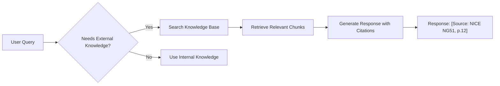
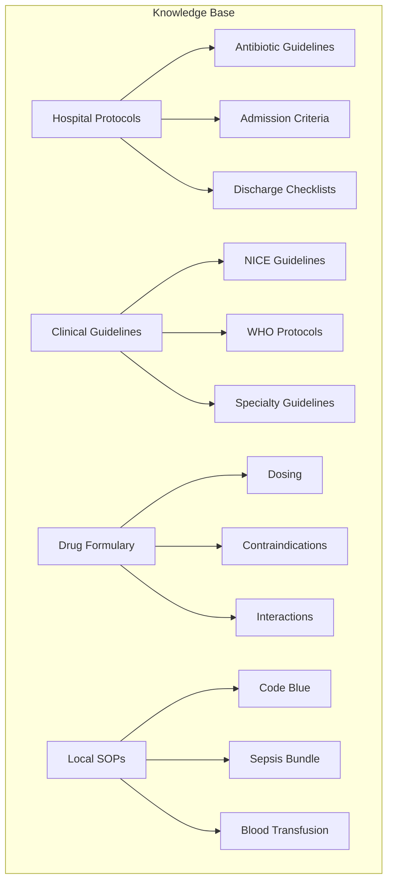
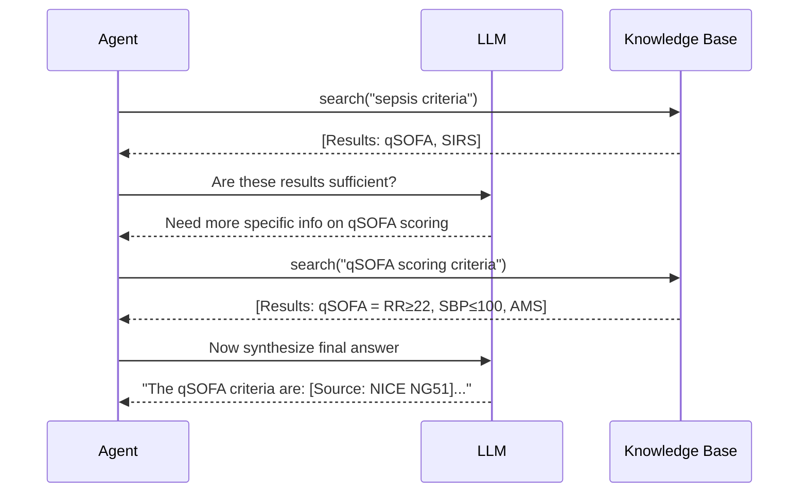

# Phase 3: Knowledge Base RAG — ULTRATHINK Implementation Plan

> **Objective:** Give Jarvis access to external medical knowledge (guidelines, protocols, formulary) so it can answer questions grounded in authoritative sources with citations.

---

## 1. Executive Summary

| Attribute | Value |
|---|---|
| **Scope** | Implement RAG over medical guidelines using Gemini File Search Tool |
| **Dependencies** | Phase 1 (Tool Use), Gemini API (existing) |
| **New Files** | 4 new TypeScript files + Admin UI component |
| **Modified Files** | 2 existing files |
| **Estimated Effort** | 3-4 days |
| **Risk Level** | Medium-High (document quality, citation accuracy) |

---

## 2. ULTRATHINK: Why Knowledge Base RAG Matters

### 2.1 The Grounding Problem

| Scenario | Current Jarvis | Jarvis with Knowledge RAG |
|---|---|---|
| "What are the qSOFA criteria for sepsis?" | LLM's training data (may be outdated) | ✅ Cites NICE Guideline NG51 Section 2.3 |
| "What's the hospital's antibiotic protocol for CAP?" | ❌ No access to hospital SOPs | ✅ Retrieves local protocol document |
| "Is Metformin contraindicated in renal failure?" | General knowledge | ✅ Cites hospital formulary with eGFR cutoffs |
| "What's the dosage for Vancomycin?" | May hallucinate | ✅ Cites formulary: "15-20mg/kg q8-12h, adjust for CrCl" |

### 2.2 The Citation Imperative

**In medicine, "Jarvis said so" is not evidence-based.** Every factual claim must trace back to a verifiable source.



---

## 3. Technology Decision: Gemini File Search Tool

### 3.1 Option Analysis (ULTRATHINK)

| Option | Description | Pros | Cons | Decision |
|---|---|---|---|---|
| **A: Custom RAG** | Build own chunking, embedding, vector store | Full control | 4-6 weeks effort, maintenance burden | ❌ |
| **B: LangChain + Pinecone** | Use LangChain with external vector DB | Flexible | Extra service, cost, latency | ❌ |
| **C: Gemini File Search Tool** | Google's managed RAG (Nov 2025) | Automatic chunking, embedding, search; native integration | Newer API, limited customization | ✅ **Selected** |

**Rationale:** The Gemini File Search Tool (launched Nov 2025) provides:
- Automatic optimal chunking
- `gemini-embedding-001` (3072-dim, multilingual)
- Vector search abstracted away
- Built-in citations
- Free storage at query time

This reduces implementation from weeks to days while providing production-quality RAG.

---

## 4. Knowledge Base Architecture

### 4.1 Document Categories



### 4.2 Document Metadata Schema

```typescript
interface KnowledgeDocument {
    documentId: string;           // UUID
    fileId: string;               // Gemini File API ID
    
    // Metadata
    title: string;                // "NICE Sepsis Guideline NG51"
    category: DocumentCategory;   // 'guideline' | 'protocol' | 'formulary' | 'sop'
    source: string;               // "NICE" | "WHO" | "Hospital"
    version: string;              // "v2.0 - 2024"
    lastUpdated: string;          // ISO date
    
    // Access Control
    accessLevel: 'public' | 'internal' | 'restricted';
    
    // Indexing Status
    status: 'pending' | 'indexed' | 'failed';
    chunkCount?: number;
    errorMessage?: string;
}

type DocumentCategory = 'guideline' | 'protocol' | 'formulary' | 'sop' | 'reference';
```

---

## 5. File-Level Implementation Plan

### 5.1 New Files

```
services/
└── jarvis/
    └── knowledge/
        ├── KnowledgeBase.ts       # Main KB service (upload, search)
        ├── GeminiFileAPI.ts       # Wrapper for Gemini File API
        ├── CitationFormatter.ts   # Format citations for display
        └── types.ts               # KB types

components/
└── admin/
    └── KnowledgeUploader.tsx     # Admin UI for document upload
```

---

### 5.2 Detailed File Specifications

#### **File 1: `services/jarvis/knowledge/types.ts`**

```typescript
export interface KnowledgeDocument {
    documentId: string;
    fileId: string;
    title: string;
    category: DocumentCategory;
    source: string;
    version: string;
    lastUpdated: string;
    accessLevel: 'public' | 'internal' | 'restricted';
    status: 'pending' | 'indexed' | 'failed';
    chunkCount?: number;
    errorMessage?: string;
}

export type DocumentCategory = 'guideline' | 'protocol' | 'formulary' | 'sop' | 'reference';

export interface SearchResult {
    content: string;          // The retrieved chunk text
    documentId: string;
    documentTitle: string;
    source: string;
    relevanceScore: number;   // 0-1
    pageNumber?: number;      // If available from PDF
}

export interface KnowledgeConfig {
    enabled: boolean;
    maxResultsPerQuery: number;
    relevanceThreshold: number;
}
```

---

#### **File 2: `services/jarvis/knowledge/GeminiFileAPI.ts`**

```typescript
import { GoogleGenAI } from '@google/genai';

const ai = new GoogleGenAI({ apiKey: import.meta.env.VITE_GEMINI_API_KEY || 'mock-key' });

/**
 * Upload a file to Gemini File API for RAG indexing
 */
export async function uploadFile(
    file: File,
    displayName: string
): Promise<{ fileId: string; status: string } | null> {
    try {
        // Convert File to base64 for API
        const arrayBuffer = await file.arrayBuffer();
        const base64 = btoa(String.fromCharCode(...new Uint8Array(arrayBuffer)));
        
        const result = await ai.files.upload({
            file: {
                data: base64,
                mimeType: file.type,
            },
            config: {
                displayName: displayName,
            }
        });
        
        return {
            fileId: result.file?.name || '',
            status: result.file?.state || 'unknown'
        };
    } catch (error) {
        console.error('[GeminiFileAPI] Upload error:', error);
        return null;
    }
}

/**
 * Wait for file to be processed (indexed)
 */
export async function waitForProcessing(fileId: string, maxWaitMs: number = 60000): Promise<boolean> {
    const startTime = Date.now();
    
    while (Date.now() - startTime < maxWaitMs) {
        try {
            const file = await ai.files.get({ name: fileId });
            if (file.file?.state === 'ACTIVE') {
                return true;
            }
            if (file.file?.state === 'FAILED') {
                console.error('[GeminiFileAPI] File processing failed');
                return false;
            }
            // Wait 2 seconds before checking again
            await new Promise(resolve => setTimeout(resolve, 2000));
        } catch (error) {
            console.error('[GeminiFileAPI] Status check error:', error);
            return false;
        }
    }
    
    console.error('[GeminiFileAPI] Processing timeout');
    return false;
}

/**
 * Delete a file from Gemini File API
 */
export async function deleteFile(fileId: string): Promise<boolean> {
    try {
        await ai.files.delete({ name: fileId });
        return true;
    } catch (error) {
        console.error('[GeminiFileAPI] Delete error:', error);
        return false;
    }
}

/**
 * List all uploaded files
 */
export async function listFiles(): Promise<Array<{ name: string; displayName: string; state: string }>> {
    try {
        const result = await ai.files.list();
        return result.files?.map(f => ({
            name: f.name || '',
            displayName: f.displayName || '',
            state: f.state || 'unknown'
        })) || [];
    } catch (error) {
        console.error('[GeminiFileAPI] List error:', error);
        return [];
    }
}
```

---

#### **File 3: `services/jarvis/knowledge/KnowledgeBase.ts`**

```typescript
import { db, isFirebaseInitialized } from '../../firebase';
import { collection, addDoc, getDocs, deleteDoc, doc, updateDoc, query, where } from 'firebase/firestore';
import { KnowledgeDocument, SearchResult, DocumentCategory, KnowledgeConfig } from './types';
import { uploadFile, waitForProcessing, deleteFile } from './GeminiFileAPI';
import { GoogleGenAI } from '@google/genai';

const ai = new GoogleGenAI({ apiKey: import.meta.env.VITE_GEMINI_API_KEY || 'mock-key' });

const DEFAULT_CONFIG: KnowledgeConfig = {
    enabled: import.meta.env.VITE_JARVIS_KNOWLEDGE_ENABLED !== 'false',
    maxResultsPerQuery: 5,
    relevanceThreshold: 0.5,
};

/**
 * Add a document to the Knowledge Base
 */
export async function addDocument(
    file: File,
    metadata: {
        title: string;
        category: DocumentCategory;
        source: string;
        version: string;
        accessLevel: 'public' | 'internal' | 'restricted';
    }
): Promise<KnowledgeDocument | null> {
    if (!DEFAULT_CONFIG.enabled) {
        console.log('[KnowledgeBase] Knowledge base disabled');
        return null;
    }
    
    try {
        // 1. Upload to Gemini File API
        const uploadResult = await uploadFile(file, metadata.title);
        if (!uploadResult) {
            throw new Error('Failed to upload file to Gemini');
        }
        
        // 2. Wait for indexing
        const processed = await waitForProcessing(uploadResult.fileId);
        
        // 3. Create document record
        const documentData: Omit<KnowledgeDocument, 'documentId'> = {
            fileId: uploadResult.fileId,
            title: metadata.title,
            category: metadata.category,
            source: metadata.source,
            version: metadata.version,
            lastUpdated: new Date().toISOString(),
            accessLevel: metadata.accessLevel,
            status: processed ? 'indexed' : 'failed',
            errorMessage: processed ? undefined : 'Indexing failed or timed out'
        };
        
        // 4. Save to Firestore
        if (isFirebaseInitialized && db) {
            const docRef = await addDoc(collection(db, 'knowledge_base'), documentData);
            return { documentId: docRef.id, ...documentData };
        }
        
        return { documentId: `local-${Date.now()}`, ...documentData };
        
    } catch (error: any) {
        console.error('[KnowledgeBase] Add document error:', error);
        return null;
    }
}

/**
 * Search the Knowledge Base using Gemini File Search
 */
export async function searchKnowledge(
    queryText: string,
    category?: DocumentCategory
): Promise<SearchResult[]> {
    if (!DEFAULT_CONFIG.enabled) {
        return [];
    }
    
    try {
        // Get all indexed documents
        const documents = await getAllDocuments();
        const indexedDocs = documents.filter(d => d.status === 'indexed');
        
        if (indexedDocs.length === 0) {
            console.log('[KnowledgeBase] No indexed documents available');
            return [];
        }
        
        // Filter by category if specified
        const targetDocs = category 
            ? indexedDocs.filter(d => d.category === category)
            : indexedDocs;
        
        // Build file references for Gemini
        const fileRefs = targetDocs.map(d => ({ fileData: { fileUri: d.fileId } }));
        
        // Use Gemini with file search tool
        const response = await ai.models.generateContent({
            model: 'gemini-2.5-flash',
            contents: [
                ...fileRefs.map(ref => ({ role: 'user', parts: [ref] })),
                { role: 'user', parts: [{ text: queryText }] }
            ],
            config: {
                tools: [{ fileSearch: {} }],  // Enable file search
            }
        });
        
        // Extract citations from response
        const text = response.text || '';
        const groundingMetadata = response.candidates?.[0]?.groundingMetadata;
        
        // Format results with citations
        const results: SearchResult[] = [];
        
        if (groundingMetadata?.groundingChunks) {
            for (const chunk of groundingMetadata.groundingChunks) {
                const docInfo = targetDocs.find(d => d.fileId === chunk.retrievedContext?.uri);
                results.push({
                    content: chunk.retrievedContext?.text || '',
                    documentId: docInfo?.documentId || 'unknown',
                    documentTitle: docInfo?.title || 'Unknown Document',
                    source: docInfo?.source || 'Unknown',
                    relevanceScore: chunk.relevanceScore || 0.5,
                    pageNumber: chunk.retrievedContext?.pageNumber
                });
            }
        }
        
        return results.slice(0, DEFAULT_CONFIG.maxResultsPerQuery);
        
    } catch (error) {
        console.error('[KnowledgeBase] Search error:', error);
        return [];
    }
}

/**
 * Get all documents in the Knowledge Base
 */
export async function getAllDocuments(): Promise<KnowledgeDocument[]> {
    if (!isFirebaseInitialized || !db) {
        return [];
    }
    
    try {
        const snapshot = await getDocs(collection(db, 'knowledge_base'));
        return snapshot.docs.map(doc => ({
            documentId: doc.id,
            ...doc.data()
        } as KnowledgeDocument));
    } catch (error) {
        console.error('[KnowledgeBase] Get documents error:', error);
        return [];
    }
}

/**
 * Remove a document from the Knowledge Base
 */
export async function removeDocument(documentId: string): Promise<boolean> {
    try {
        // Get document to find file ID
        const documents = await getAllDocuments();
        const targetDoc = documents.find(d => d.documentId === documentId);
        
        if (!targetDoc) return false;
        
        // Delete from Gemini File API
        if (targetDoc.fileId) {
            await deleteFile(targetDoc.fileId);
        }
        
        // Delete from Firestore
        if (isFirebaseInitialized && db) {
            await deleteDoc(doc(db, 'knowledge_base', documentId));
        }
        
        return true;
    } catch (error) {
        console.error('[KnowledgeBase] Remove document error:', error);
        return false;
    }
}
```

---

#### **File 4: `services/jarvis/knowledge/CitationFormatter.ts`**

```typescript
import { SearchResult } from './types';

/**
 * Format search results into a citation string for LLM context
 */
export function formatCitationsForContext(results: SearchResult[]): string {
    if (results.length === 0) return '';
    
    const citations = results.map((r, i) => {
        const page = r.pageNumber ? `, p.${r.pageNumber}` : '';
        return `[${i + 1}] ${r.documentTitle} (${r.source}${page}):\n"${r.content.slice(0, 500)}..."`;
    }).join('\n\n');
    
    return `\n--- Retrieved Knowledge ---\n${citations}\n--- End Knowledge ---\n\nIMPORTANT: When using information from the above sources, cite them using [Source: Title, Section/Page].`;
}

/**
 * Format inline citation for display
 */
export function formatInlineCitation(result: SearchResult): string {
    const page = result.pageNumber ? `, p.${result.pageNumber}` : '';
    return `[Source: ${result.documentTitle}${page}]`;
}

/**
 * Extract and format citations from Jarvis response
 */
export function extractCitations(response: string): { text: string; citations: string[] } {
    const citationPattern = /\[Source: ([^\]]+)\]/g;
    const citations: string[] = [];
    let match;
    
    while ((match = citationPattern.exec(response)) !== null) {
        citations.push(match[1]);
    }
    
    return { text: response, citations: [...new Set(citations)] };
}
```

---

#### **File 5: `components/admin/KnowledgeUploader.tsx`**

```tsx
import React, { useState, useEffect } from 'react';
import { Button } from '../ui/button';
import { Input } from '../ui/input';
import { Card, CardHeader, CardTitle, CardContent } from '../ui/card';
import { Badge } from '../ui/badge';
import { Upload, Trash2, FileText, CheckCircle, AlertCircle, Loader2 } from 'lucide-react';
import { addDocument, getAllDocuments, removeDocument } from '../../services/jarvis/knowledge/KnowledgeBase';
import { KnowledgeDocument, DocumentCategory } from '../../services/jarvis/knowledge/types';

const CATEGORIES: { value: DocumentCategory; label: string }[] = [
    { value: 'guideline', label: 'Clinical Guideline' },
    { value: 'protocol', label: 'Hospital Protocol' },
    { value: 'formulary', label: 'Drug Formulary' },
    { value: 'sop', label: 'Standard Operating Procedure' },
    { value: 'reference', label: 'Reference Material' },
];

export const KnowledgeUploader: React.FC = () => {
    const [documents, setDocuments] = useState<KnowledgeDocument[]>([]);
    const [isLoading, setIsLoading] = useState(false);
    const [uploadState, setUploadState] = useState<'idle' | 'uploading' | 'success' | 'error'>('idle');
    
    // Form state
    const [selectedFile, setSelectedFile] = useState<File | null>(null);
    const [title, setTitle] = useState('');
    const [category, setCategory] = useState<DocumentCategory>('guideline');
    const [source, setSource] = useState('');
    const [version, setVersion] = useState('v1.0');
    
    useEffect(() => {
        loadDocuments();
    }, []);
    
    const loadDocuments = async () => {
        const docs = await getAllDocuments();
        setDocuments(docs);
    };
    
    const handleUpload = async () => {
        if (!selectedFile || !title || !source) return;
        
        setIsLoading(true);
        setUploadState('uploading');
        
        const result = await addDocument(selectedFile, {
            title,
            category,
            source,
            version,
            accessLevel: 'internal'
        });
        
        if (result) {
            setUploadState('success');
            setDocuments(prev => [...prev, result]);
            // Reset form
            setSelectedFile(null);
            setTitle('');
            setSource('');
        } else {
            setUploadState('error');
        }
        
        setIsLoading(false);
        setTimeout(() => setUploadState('idle'), 3000);
    };
    
    const handleDelete = async (docId: string) => {
        if (confirm('Are you sure you want to remove this document?')) {
            await removeDocument(docId);
            setDocuments(prev => prev.filter(d => d.documentId !== docId));
        }
    };
    
    return (
        <div className="space-y-6 p-6">
            <h1 className="text-2xl font-bold">Knowledge Base Manager</h1>
            
            {/* Upload Form */}
            <Card>
                <CardHeader>
                    <CardTitle className="flex items-center gap-2">
                        <Upload className="w-5 h-5" />
                        Upload New Document
                    </CardTitle>
                </CardHeader>
                <CardContent className="space-y-4">
                    <Input
                        type="file"
                        accept=".pdf,.docx,.txt,.md"
                        onChange={(e) => setSelectedFile(e.target.files?.[0] || null)}
                    />
                    <Input
                        placeholder="Document Title"
                        value={title}
                        onChange={(e) => setTitle(e.target.value)}
                    />
                    <select
                        className="w-full p-2 border rounded"
                        value={category}
                        onChange={(e) => setCategory(e.target.value as DocumentCategory)}
                    >
                        {CATEGORIES.map(c => (
                            <option key={c.value} value={c.value}>{c.label}</option>
                        ))}
                    </select>
                    <Input
                        placeholder="Source (e.g., NICE, WHO, Hospital)"
                        value={source}
                        onChange={(e) => setSource(e.target.value)}
                    />
                    <Input
                        placeholder="Version"
                        value={version}
                        onChange={(e) => setVersion(e.target.value)}
                    />
                    <Button onClick={handleUpload} disabled={isLoading || !selectedFile}>
                        {isLoading ? <Loader2 className="w-4 h-4 animate-spin mr-2" /> : null}
                        Upload & Index
                    </Button>
                    {uploadState === 'success' && (
                        <p className="text-green-600 flex items-center gap-1">
                            <CheckCircle className="w-4 h-4" /> Document indexed successfully!
                        </p>
                    )}
                    {uploadState === 'error' && (
                        <p className="text-red-600 flex items-center gap-1">
                            <AlertCircle className="w-4 h-4" /> Upload failed. Please try again.
                        </p>
                    )}
                </CardContent>
            </Card>
            
            {/* Document List */}
            <Card>
                <CardHeader>
                    <CardTitle className="flex items-center gap-2">
                        <FileText className="w-5 h-5" />
                        Indexed Documents ({documents.length})
                    </CardTitle>
                </CardHeader>
                <CardContent>
                    <div className="space-y-2">
                        {documents.map(doc => (
                            <div key={doc.documentId} className="flex items-center justify-between p-3 bg-muted rounded-lg">
                                <div>
                                    <p className="font-medium">{doc.title}</p>
                                    <p className="text-sm text-muted-foreground">
                                        {doc.source} • {doc.version} • {doc.category}
                                    </p>
                                </div>
                                <div className="flex items-center gap-2">
                                    <Badge variant={doc.status === 'indexed' ? 'default' : 'destructive'}>
                                        {doc.status}
                                    </Badge>
                                    <Button variant="ghost" size="sm" onClick={() => handleDelete(doc.documentId)}>
                                        <Trash2 className="w-4 h-4 text-destructive" />
                                    </Button>
                                </div>
                            </div>
                        ))}
                        {documents.length === 0 && (
                            <p className="text-muted-foreground text-center py-4">
                                No documents indexed yet. Upload your first document above.
                            </p>
                        )}
                    </div>
                </CardContent>
            </Card>
        </div>
    );
};
```

---

### 5.3 Modified Files

#### **Modify: `services/jarvis/agent/ToolRegistry.ts`**

**Add new tool:**

```typescript
{
    name: 'search_knowledge_base',
    description: 'Search the medical knowledge base for guidelines, protocols, drug information, or hospital SOPs. Use when user asks about medical guidelines, dosing, protocols, or "what does the guideline say". Always cite the source in your response.',
    parameters: {
        type: Type.OBJECT,
        properties: {
            query: { type: Type.STRING, description: 'The search query.' },
            category: { 
                type: Type.STRING, 
                enum: ['guideline', 'protocol', 'formulary', 'sop', 'reference'],
                description: 'Optional category filter.' 
            }
        },
        required: ['query']
    },
    handler: async (params, ctx) => {
        const { searchKnowledge } = await import('../knowledge/KnowledgeBase');
        const { formatCitationsForContext } = await import('../knowledge/CitationFormatter');
        
        const results = await searchKnowledge(params.query, params.category);
        
        if (results.length === 0) {
            return { 
                success: true, 
                data: { results: [], message: 'No relevant documents found.' },
                rationale: 'Searched knowledge base but found no matches.'
            };
        }
        
        return {
            success: true,
            data: {
                results: results.map(r => ({
                    title: r.documentTitle,
                    source: r.source,
                    content: r.content,
                    relevance: r.relevanceScore
                })),
                formattedCitations: formatCitationsForContext(results)
            },
            rationale: `Found ${results.length} relevant documents.`
        };
    }
}
```

---

## 6. Agentic RAG: Self-Correcting Search

### 6.1 The Problem

Simple RAG: `Query → Search → Return first result`  
But what if the first result is wrong or incomplete?

### 6.2 The Solution: Agentic RAG Loop



### 6.3 Implementation in AgentLoop

The existing ReAct loop already supports this! If the LLM decides the first search result is insufficient, it can call `search_knowledge_base` again with a refined query.

---

## 7. Edge Cases & Error Handling

| Scenario | Handling |
|---|---|
| No documents indexed | Return graceful message: "Knowledge base is empty." |
| File upload fails | Return error, keep UI responsive |
| Document processing timeout | Mark as 'failed', allow retry |
| Irrelevant results | LLM filters via self-reflection (Agentic RAG) |
| Citation not found in response | Log warning, suggest citation |

---

## 8. Security & Compliance

| Concern | Mitigation |
|---|---|
| Unauthorized document access | Access levels: public/internal/restricted |
| Outdated information | Version tracking, lastUpdated field |
| Citation accuracy | Gemini grounding metadata provides source tracing |
| Document retention | Admin can delete, automatic version control |

---

## 9. Testing Strategy

### 9.1 Unit Tests

```typescript
describe('KnowledgeBase', () => {
    it('formats citations correctly', () => {
        const result: SearchResult = {
            content: 'qSOFA criteria include...',
            documentId: 'doc1',
            documentTitle: 'NICE Sepsis Guideline',
            source: 'NICE',
            relevanceScore: 0.9,
            pageNumber: 12
        };
        const citation = formatInlineCitation(result);
        expect(citation).toBe('[Source: NICE Sepsis Guideline, p.12]');
    });
});
```

### 9.2 Integration Tests

```typescript
test('Jarvis cites knowledge base in response', async ({ page }) => {
    // Assume a test document is already indexed
    await page.fill('[data-testid="jarvis-input"]', 'What are the qSOFA criteria?');
    await page.keyboard.press('Enter');
    
    // Response should include citation
    await expect(page.locator('text=[Source:')).toBeVisible({ timeout: 20000 });
});
```

---

## 10. Rollback Procedure

1.  **Immediate:** Set `VITE_JARVIS_KNOWLEDGE_ENABLED=false` in `.env`
2.  **Data:** Firestore metadata remains, Gemini files remain (can be cleaned up later)
3.  **Code:** Remove `search_knowledge_base` tool from registry

---

## 11. Success Metrics

| Metric | Target | Measurement |
|---|---|---|
| Knowledge retrieval rate | >40% of factual queries use KB | Log tool usage |
| Citation accuracy | 100% of KB responses include citation | Audit responses |
| User trust | >80% find KB responses helpful | Feedback button |

---

## 12. Acceptance Criteria

- [ ] Admin can upload PDF/DOCX to Knowledge Base
- [ ] Documents are indexed by Gemini File API
- [ ] `search_knowledge_base` tool retrieves relevant chunks
- [ ] Responses include inline citations `[Source: ...]`
- [ ] "What does the guideline say about X?" returns grounded answer
- [ ] Feature flag disables knowledge base completely
- [ ] Integration test verifies citation presence
