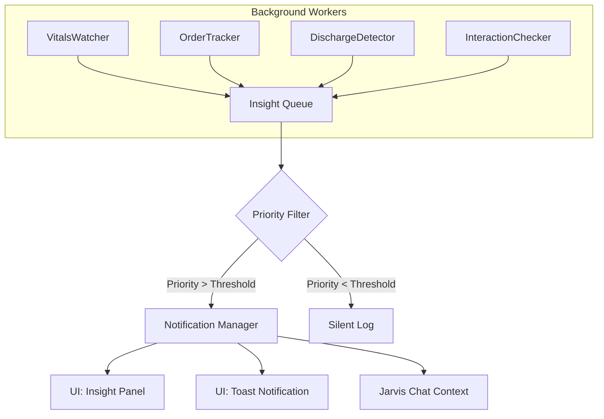

# Phase 4: Proactive Insights — ULTRATHINK Implementation Plan

> **Objective:** Transform Jarvis from reactive (waits for questions) to proactive (surfaces critical information before being asked).

---

## 1. Executive Summary

| Attribute | Value |
|---|---|
| **Scope** | Implement background workers that detect and surface clinical insights |
| **Dependencies** | Phase 1 (Tool Use), CDS Engine (existing) |
| **New Files** | 5 new TypeScript files + UI components |
| **Modified Files** | 3 existing files |
| **Estimated Effort** | 2-3 days |
| **Risk Level** | Medium (alert fatigue is the #1 risk) |

---

## 2. ULTRATHINK: The Proactive Intelligence Problem

### 2.1 Why Proactivity Matters

| Scenario | Reactive Jarvis | Proactive Jarvis |
|---|---|---|
| Vitals deteriorating | Doctor must ask "How are vitals?" | ⚠️ "Gita's SpO2 dropped to 88%. Recommend O2 supplementation." |
| Lab pending >24h | Doctor forgets to check | 📋 "CBC ordered 26h ago still pending. Escalate?" |
| Drug interaction | Doctor may miss | 💊 "New Warfarin order conflicts with existing Aspirin." |
| Discharge ready | Doctor doesn't know | ✅ "3 patients meet discharge criteria today." |

### 2.2 The Alert Fatigue Problem (ULTRATHINK Critical Path)

> **Alert fatigue is why most clinical decision support fails.**

| Problem | Impact | Our Solution |
|---|---|---|
| Too many alerts | Doctors ignore all alerts | **Priority scoring (0-1)** with configurable threshold |
| Irrelevant alerts | Erodes trust | **Context-aware filtering** (only alert if doctor is viewing related patient) |
| Redundant alerts | Annoying | **Deduplication** (don't alert same issue twice in 1 hour) |
| Unactionable alerts | Waste of time | **Action buttons** (one-click resolution) |

---

## 3. Architecture Overview



---

## 4. Insight Types & Priority Scoring

### 4.1 Insight Schema

```typescript
interface ProactiveInsight {
    insightId: string;
    type: InsightType;
    priority: number;           // 0.0 - 1.0
    
    // Context
    patientId?: string;
    patientName?: string;
    
    // Content
    title: string;              // "SpO2 Critical"
    message: string;            // "Gita's SpO2 dropped to 88%"
    
    // Actionability
    actions?: InsightAction[];
    
    // Lifecycle
    createdAt: string;
    expiresAt?: string;         // Auto-dismiss after time
    status: 'pending' | 'acknowledged' | 'actioned' | 'dismissed';
    
    // Deduplication
    dedupeKey: string;          // "vitals:P-001:spo2_low"
}

type InsightType = 
    | 'vitals_critical'
    | 'vitals_warning'
    | 'order_delayed'
    | 'order_conflict'
    | 'discharge_ready'
    | 'drug_interaction'
    | 'follow_up_due'
    | 'documentation_incomplete';

interface InsightAction {
    label: string;
    actionType: 'navigate' | 'order' | 'dismiss' | 'escalate';
    payload: Record<string, any>;
}
```

### 4.2 Priority Scoring Matrix

| Insight Type | Base Priority | Modifiers |
|---|---|---|
| `vitals_critical` (SpO2<90, HR>150) | 0.95 | +0.05 if triage=Red |
| `vitals_warning` (SpO2 90-94) | 0.70 | +0.10 if trending down |
| `drug_interaction` (severe) | 0.90 | - |
| `drug_interaction` (moderate) | 0.60 | - |
| `order_delayed` (>24h) | 0.50 | +0.20 if priority=STAT |
| `discharge_ready` | 0.40 | +0.15 if LOS > avg |
| `documentation_incomplete` | 0.30 | - |

**Default Threshold:** 0.5 (only show priority ≥ 0.5)

---

## 5. File-Level Implementation Plan

### 5.1 New Files

```
services/
└── jarvis/
    └── proactive/
        ├── types.ts              # Insight types
        ├── InsightManager.ts     # Queue, dedupe, notify
        ├── VitalsWatcher.ts      # Monitor vitals changes
        ├── OrderTracker.ts       # Track delayed orders
        └── DischargeDetector.ts  # Identify discharge-ready patients

components/
└── jarvis/
    └── InsightPanel.tsx         # UI for displaying insights
```

---

### 5.2 Detailed File Specifications

#### **File 1: `services/jarvis/proactive/types.ts`**

```typescript
export interface ProactiveInsight {
    insightId: string;
    type: InsightType;
    priority: number;
    patientId?: string;
    patientName?: string;
    title: string;
    message: string;
    actions?: InsightAction[];
    createdAt: string;
    expiresAt?: string;
    status: 'pending' | 'acknowledged' | 'actioned' | 'dismissed';
    dedupeKey: string;
}

export type InsightType = 
    | 'vitals_critical'
    | 'vitals_warning'
    | 'order_delayed'
    | 'order_conflict'
    | 'discharge_ready'
    | 'drug_interaction'
    | 'follow_up_due'
    | 'documentation_incomplete';

export interface InsightAction {
    label: string;
    actionType: 'navigate' | 'order' | 'dismiss' | 'escalate';
    payload: Record<string, any>;
}

export interface ProactiveConfig {
    enabled: boolean;
    priorityThreshold: number;      // 0-1, only show above this
    dedupeWindowMs: number;         // Don't repeat same alert within window
    maxActiveInsights: number;      // Limit to prevent overload
    autoExpireMs: number;           // Auto-dismiss after time
}

export const DEFAULT_PROACTIVE_CONFIG: ProactiveConfig = {
    enabled: true,
    priorityThreshold: 0.5,
    dedupeWindowMs: 60 * 60 * 1000,  // 1 hour
    maxActiveInsights: 10,
    autoExpireMs: 8 * 60 * 60 * 1000, // 8 hours
};
```

---

#### **File 2: `services/jarvis/proactive/InsightManager.ts`**

```typescript
import { ProactiveInsight, ProactiveConfig, DEFAULT_PROACTIVE_CONFIG } from './types';

class InsightManagerClass {
    private insights: Map<string, ProactiveInsight> = new Map();
    private recentDedupeKeys: Map<string, number> = new Map();  // key -> timestamp
    private listeners: Set<(insights: ProactiveInsight[]) => void> = new Set();
    private config: ProactiveConfig = DEFAULT_PROACTIVE_CONFIG;
    
    /**
     * Add a new insight (with deduplication and priority filtering)
     */
    addInsight(insight: Omit<ProactiveInsight, 'insightId' | 'createdAt' | 'status'>): boolean {
        if (!this.config.enabled) return false;
        
        // Priority filter
        if (insight.priority < this.config.priorityThreshold) {
            console.log(`[InsightManager] Insight below threshold: ${insight.title}`);
            return false;
        }
        
        // Deduplication
        const lastSeen = this.recentDedupeKeys.get(insight.dedupeKey);
        if (lastSeen && Date.now() - lastSeen < this.config.dedupeWindowMs) {
            console.log(`[InsightManager] Dedupe: ${insight.dedupeKey}`);
            return false;
        }
        
        // Max insights limit
        if (this.insights.size >= this.config.maxActiveInsights) {
            // Remove lowest priority
            const sorted = [...this.insights.values()].sort((a, b) => a.priority - b.priority);
            if (sorted[0] && sorted[0].priority < insight.priority) {
                this.insights.delete(sorted[0].insightId);
            } else {
                return false;
            }
        }
        
        const fullInsight: ProactiveInsight = {
            ...insight,
            insightId: `INS-${Date.now()}-${Math.random().toString(36).slice(2, 7)}`,
            createdAt: new Date().toISOString(),
            status: 'pending',
            expiresAt: new Date(Date.now() + this.config.autoExpireMs).toISOString()
        };
        
        this.insights.set(fullInsight.insightId, fullInsight);
        this.recentDedupeKeys.set(insight.dedupeKey, Date.now());
        
        this.notifyListeners();
        return true;
    }
    
    /**
     * Update insight status
     */
    updateStatus(insightId: string, status: ProactiveInsight['status']): void {
        const insight = this.insights.get(insightId);
        if (insight) {
            insight.status = status;
            if (status === 'actioned' || status === 'dismissed') {
                this.insights.delete(insightId);
            }
            this.notifyListeners();
        }
    }
    
    /**
     * Get all active insights (sorted by priority)
     */
    getActiveInsights(): ProactiveInsight[] {
        const now = Date.now();
        const active: ProactiveInsight[] = [];
        
        this.insights.forEach((insight, id) => {
            // Check expiry
            if (insight.expiresAt && new Date(insight.expiresAt).getTime() < now) {
                this.insights.delete(id);
                return;
            }
            if (insight.status === 'pending' || insight.status === 'acknowledged') {
                active.push(insight);
            }
        });
        
        return active.sort((a, b) => b.priority - a.priority);
    }
    
    /**
     * Subscribe to insight changes
     */
    subscribe(callback: (insights: ProactiveInsight[]) => void): () => void {
        this.listeners.add(callback);
        callback(this.getActiveInsights());  // Initial call
        return () => this.listeners.delete(callback);
    }
    
    /**
     * Update configuration
     */
    setConfig(config: Partial<ProactiveConfig>): void {
        this.config = { ...this.config, ...config };
    }
    
    private notifyListeners(): void {
        const active = this.getActiveInsights();
        this.listeners.forEach(cb => cb(active));
    }
}

// Singleton
export const InsightManager = new InsightManagerClass();
```

---

#### **File 3: `services/jarvis/proactive/VitalsWatcher.ts`**

```typescript
import { Patient } from '../../../types';
import { InsightManager } from './InsightManager';
import { InsightAction } from './types';

interface VitalsThresholds {
    spo2_critical: number;
    spo2_warning: number;
    hr_critical_high: number;
    hr_critical_low: number;
    temp_critical: number;
    sbp_critical_low: number;
}

const THRESHOLDS: VitalsThresholds = {
    spo2_critical: 90,
    spo2_warning: 94,
    hr_critical_high: 150,
    hr_critical_low: 40,
    temp_critical: 39.5,
    sbp_critical_low: 90,
};

/**
 * Analyze patient vitals and generate insights
 */
export function analyzeVitals(patient: Patient): void {
    const vitals = patient.vitals;
    if (!vitals) return;
    
    const actions: InsightAction[] = [
        { label: 'View Patient', actionType: 'navigate', payload: { patientId: patient.id } },
        { label: 'Dismiss', actionType: 'dismiss', payload: {} }
    ];
    
    // SpO2 Critical
    if (vitals.spo2 && vitals.spo2 < THRESHOLDS.spo2_critical) {
        InsightManager.addInsight({
            type: 'vitals_critical',
            priority: 0.95,
            patientId: patient.id,
            patientName: patient.name,
            title: '🔴 SpO2 Critical',
            message: `${patient.name}'s SpO2 is ${vitals.spo2}%. Immediate intervention required.`,
            actions: [
                ...actions,
                { label: 'Order O2', actionType: 'order', payload: { category: 'nursing', label: 'Oxygen Supplementation' } }
            ],
            dedupeKey: `vitals:${patient.id}:spo2_critical`
        });
    }
    // SpO2 Warning
    else if (vitals.spo2 && vitals.spo2 < THRESHOLDS.spo2_warning) {
        InsightManager.addInsight({
            type: 'vitals_warning',
            priority: 0.70,
            patientId: patient.id,
            patientName: patient.name,
            title: '🟡 SpO2 Low',
            message: `${patient.name}'s SpO2 is ${vitals.spo2}%. Monitor closely.`,
            actions,
            dedupeKey: `vitals:${patient.id}:spo2_warning`
        });
    }
    
    // Heart Rate Critical
    if (vitals.pulse && (vitals.pulse > THRESHOLDS.hr_critical_high || vitals.pulse < THRESHOLDS.hr_critical_low)) {
        InsightManager.addInsight({
            type: 'vitals_critical',
            priority: 0.90,
            patientId: patient.id,
            patientName: patient.name,
            title: '🔴 Heart Rate Abnormal',
            message: `${patient.name}'s HR is ${vitals.pulse} bpm. ${vitals.pulse > 150 ? 'Tachycardia' : 'Bradycardia'} alert.`,
            actions: [
                ...actions,
                { label: 'Order ECG', actionType: 'order', payload: { category: 'procedure', label: 'ECG (12 Lead)' } }
            ],
            dedupeKey: `vitals:${patient.id}:hr_critical`
        });
    }
    
    // Hypotension
    if (vitals.bp_sys && vitals.bp_sys < THRESHOLDS.sbp_critical_low) {
        InsightManager.addInsight({
            type: 'vitals_critical',
            priority: 0.92,
            patientId: patient.id,
            patientName: patient.name,
            title: '🔴 Hypotension',
            message: `${patient.name}'s BP is ${vitals.bp_sys}/${vitals.bp_dia} mmHg. Hypotensive.`,
            actions: [
                ...actions,
                { label: 'Fluid Bolus', actionType: 'order', payload: { category: 'medication', label: 'Normal Saline 500ml Bolus' } }
            ],
            dedupeKey: `vitals:${patient.id}:hypotension`
        });
    }
    
    // High Fever
    if (vitals.temp_c && vitals.temp_c > THRESHOLDS.temp_critical) {
        InsightManager.addInsight({
            type: 'vitals_warning',
            priority: 0.75,
            patientId: patient.id,
            patientName: patient.name,
            title: '🟡 High Fever',
            message: `${patient.name}'s temperature is ${vitals.temp_c}°C.`,
            actions: [
                ...actions,
                { label: 'Order Paracetamol', actionType: 'order', payload: { category: 'medication', label: 'Paracetamol 1g IV' } }
            ],
            dedupeKey: `vitals:${patient.id}:fever`
        });
    }
}

/**
 * Watch all patients and generate insights
 */
export function watchAllPatients(patients: Patient[]): void {
    patients.forEach(analyzeVitals);
}
```

---

#### **File 4: `services/jarvis/proactive/OrderTracker.ts`**

```typescript
import { Patient, Order } from '../../../types';
import { InsightManager } from './InsightManager';

const DELAY_THRESHOLDS = {
    stat: 2 * 60 * 60 * 1000,      // 2 hours
    urgent: 6 * 60 * 60 * 1000,    // 6 hours
    routine: 24 * 60 * 60 * 1000,  // 24 hours
};

/**
 * Check for delayed orders
 */
export function checkDelayedOrders(patient: Patient): void {
    const orders = patient.orders || [];
    const pendingOrders = orders.filter(o => o.status === 'pending' || o.status === 'draft');
    
    const now = Date.now();
    
    pendingOrders.forEach(order => {
        const createdAt = new Date(order.createdAt).getTime();
        const age = now - createdAt;
        
        let threshold = DELAY_THRESHOLDS.routine;
        let priorityBoost = 0;
        
        if (order.priority === 'STAT') {
            threshold = DELAY_THRESHOLDS.stat;
            priorityBoost = 0.3;
        } else if (order.priority === 'urgent') {
            threshold = DELAY_THRESHOLDS.urgent;
            priorityBoost = 0.15;
        }
        
        if (age > threshold) {
            const hoursDelayed = Math.round(age / (60 * 60 * 1000));
            InsightManager.addInsight({
                type: 'order_delayed',
                priority: 0.50 + priorityBoost,
                patientId: patient.id,
                patientName: patient.name,
                title: '📋 Order Delayed',
                message: `${order.label} for ${patient.name} pending for ${hoursDelayed}h.`,
                actions: [
                    { label: 'View Orders', actionType: 'navigate', payload: { patientId: patient.id, tab: 'orders' } },
                    { label: 'Escalate', actionType: 'escalate', payload: { orderId: order.orderId } },
                    { label: 'Dismiss', actionType: 'dismiss', payload: {} }
                ],
                dedupeKey: `order:${order.orderId}:delayed`
            });
        }
    });
}

/**
 * Check all patients for delayed orders
 */
export function checkAllOrders(patients: Patient[]): void {
    patients.forEach(checkDelayedOrders);
}
```

---

#### **File 5: `services/jarvis/proactive/DischargeDetector.ts`**

```typescript
import { Patient } from '../../../types';
import { InsightManager } from './InsightManager';

interface DischargeCriteria {
    vitallyStable: boolean;
    noActiveIssues: boolean;
    noStatOrders: boolean;
    clinicalFileSigned: boolean;
}

/**
 * Check if patient meets discharge criteria
 */
function checkDischargeCriteria(patient: Patient): DischargeCriteria {
    const vitals = patient.vitals;
    
    return {
        vitallyStable: !!(
            vitals &&
            vitals.spo2 && vitals.spo2 >= 95 &&
            vitals.pulse && vitals.pulse >= 60 && vitals.pulse <= 100 &&
            vitals.temp_c && vitals.temp_c < 38
        ),
        noActiveIssues: !patient.activeProblems?.some(p => p.status === 'urgent'),
        noStatOrders: !patient.orders?.some(o => o.priority === 'STAT' && o.status !== 'completed'),
        clinicalFileSigned: patient.clinicalFile?.status === 'signed'
    };
}

/**
 * Detect discharge-ready patients
 */
export function detectDischargeReady(patient: Patient): void {
    // Skip already discharged
    if (patient.status === 'Discharged' || patient.dischargeSummary?.status === 'finalized') {
        return;
    }
    
    const criteria = checkDischargeCriteria(patient);
    const allMet = Object.values(criteria).every(v => v);
    
    if (allMet) {
        // Calculate LOS
        const admissionDate = patient.admissionDate ? new Date(patient.admissionDate) : new Date(patient.registrationTime);
        const los = Math.round((Date.now() - admissionDate.getTime()) / (24 * 60 * 60 * 1000));
        
        InsightManager.addInsight({
            type: 'discharge_ready',
            priority: 0.40 + (los > 5 ? 0.15 : 0),  // Boost if long LOS
            patientId: patient.id,
            patientName: patient.name,
            title: '✅ Discharge Ready',
            message: `${patient.name} meets discharge criteria. LOS: ${los} days.`,
            actions: [
                { label: 'Start Discharge', actionType: 'navigate', payload: { patientId: patient.id, tab: 'discharge' } },
                { label: 'Later', actionType: 'dismiss', payload: {} }
            ],
            dedupeKey: `discharge:${patient.id}:ready`
        });
    }
}

/**
 * Check all patients for discharge readiness
 */
export function checkAllDischarges(patients: Patient[]): void {
    patients.forEach(detectDischargeReady);
}
```

---

#### **File 6: `components/jarvis/InsightPanel.tsx`**

```tsx
import React, { useState, useEffect } from 'react';
import { InsightManager } from '../../services/jarvis/proactive/InsightManager';
import { ProactiveInsight } from '../../services/jarvis/proactive/types';
import { Card, CardHeader, CardTitle, CardContent } from '../ui/card';
import { Button } from '../ui/button';
import { Badge } from '../ui/badge';
import { Bell, X, ChevronRight, AlertTriangle, CheckCircle, Clock } from 'lucide-react';
import { useNavigate } from 'react-router-dom';
import { cn } from '../../lib/utils';

const priorityColors: Record<string, string> = {
    high: 'bg-red-100 border-red-300 dark:bg-red-900/30',
    medium: 'bg-amber-100 border-amber-300 dark:bg-amber-900/30',
    low: 'bg-blue-100 border-blue-300 dark:bg-blue-900/30',
};

const typeIcons: Record<string, JSX.Element> = {
    vitals_critical: <AlertTriangle className="w-4 h-4 text-red-600" />,
    vitals_warning: <AlertTriangle className="w-4 h-4 text-amber-600" />,
    order_delayed: <Clock className="w-4 h-4 text-amber-600" />,
    discharge_ready: <CheckCircle className="w-4 h-4 text-green-600" />,
};

export const InsightPanel: React.FC = () => {
    const [insights, setInsights] = useState<ProactiveInsight[]>([]);
    const [isExpanded, setIsExpanded] = useState(false);
    const navigate = useNavigate();
    
    useEffect(() => {
        return InsightManager.subscribe(setInsights);
    }, []);
    
    const handleAction = (insight: ProactiveInsight, action: NonNullable<ProactiveInsight['actions']>[0]) => {
        if (action.actionType === 'navigate') {
            const { patientId, tab } = action.payload;
            navigate(`/patient/${patientId}/${tab || 'medview'}`);
            InsightManager.updateStatus(insight.insightId, 'actioned');
        } else if (action.actionType === 'dismiss') {
            InsightManager.updateStatus(insight.insightId, 'dismissed');
        } else if (action.actionType === 'order') {
            // TODO: Trigger order flow
            InsightManager.updateStatus(insight.insightId, 'actioned');
        }
    };
    
    const getPriorityLevel = (priority: number): 'high' | 'medium' | 'low' => {
        if (priority >= 0.8) return 'high';
        if (priority >= 0.5) return 'medium';
        return 'low';
    };
    
    if (insights.length === 0) return null;
    
    return (
        <div className="fixed bottom-4 right-4 z-50">
            {/* Collapsed Badge */}
            {!isExpanded && (
                <Button
                    onClick={() => setIsExpanded(true)}
                    className="rounded-full h-14 w-14 bg-primary shadow-lg hover:shadow-xl transition-all"
                >
                    <Bell className="w-6 h-6" />
                    <Badge className="absolute -top-1 -right-1 h-6 w-6 rounded-full p-0 flex items-center justify-center bg-red-500">
                        {insights.length}
                    </Badge>
                </Button>
            )}
            
            {/* Expanded Panel */}
            {isExpanded && (
                <Card className="w-80 max-h-96 overflow-hidden shadow-xl">
                    <CardHeader className="py-3 flex flex-row items-center justify-between">
                        <CardTitle className="text-sm font-semibold flex items-center gap-2">
                            <Bell className="w-4 h-4" />
                            Insights ({insights.length})
                        </CardTitle>
                        <Button variant="ghost" size="sm" onClick={() => setIsExpanded(false)}>
                            <X className="w-4 h-4" />
                        </Button>
                    </CardHeader>
                    <CardContent className="py-0 max-h-72 overflow-y-auto">
                        <div className="space-y-2 pb-3">
                            {insights.map(insight => (
                                <div
                                    key={insight.insightId}
                                    className={cn(
                                        "p-3 rounded-lg border",
                                        priorityColors[getPriorityLevel(insight.priority)]
                                    )}
                                >
                                    <div className="flex items-start gap-2">
                                        {typeIcons[insight.type] || <Bell className="w-4 h-4" />}
                                        <div className="flex-1 min-w-0">
                                            <p className="text-sm font-medium truncate">{insight.title}</p>
                                            <p className="text-xs text-muted-foreground mt-0.5">{insight.message}</p>
                                        </div>
                                    </div>
                                    {insight.actions && (
                                        <div className="flex gap-1 mt-2">
                                            {insight.actions.slice(0, 2).map((action, i) => (
                                                <Button
                                                    key={i}
                                                    variant={i === 0 ? 'default' : 'ghost'}
                                                    size="sm"
                                                    className="text-xs h-7"
                                                    onClick={() => handleAction(insight, action)}
                                                >
                                                    {action.label}
                                                </Button>
                                            ))}
                                        </div>
                                    )}
                                </div>
                            ))}
                        </div>
                    </CardContent>
                </Card>
            )}
        </div>
    );
};
```

---

### 5.3 Modified Files

#### **Modify: `JarvisGlobalProvider.tsx`**

Add proactive watcher on patient changes:

```typescript
import { watchAllPatients } from './proactive/VitalsWatcher';
import { checkAllOrders } from './proactive/OrderTracker';
import { checkAllDischarges } from './proactive/DischargeDetector';

// Inside useEffect that watches patients:
useEffect(() => {
    if (patients.length > 0) {
        // Run proactive analysis
        watchAllPatients(patients);
        checkAllOrders(patients);
        checkAllDischarges(patients);
        
        // Set up interval for periodic checks
        const interval = setInterval(() => {
            watchAllPatients(patients);
            checkAllOrders(patients);
        }, 5 * 60 * 1000);  // Every 5 minutes
        
        return () => clearInterval(interval);
    }
}, [patients]);
```

#### **Modify: `App.tsx`**

Mount InsightPanel globally:

```tsx
import { InsightPanel } from './components/jarvis/InsightPanel';

// Inside Router:
<InsightPanel />
```

---

## 6. Alert Fatigue Prevention Strategies

| Strategy | Implementation |
|---|---|
| **Priority Threshold** | Configurable (default 0.5), hides low-priority |
| **Deduplication** | Same alert not shown twice in 1 hour |
| **Auto-Expire** | Alerts dismissed after 8 hours |
| **Max Active** | Only 10 insights at a time |
| **Actionable** | Every alert has one-click resolution |
| **Contextual** | Future: Only show relevant to current screen |

---

## 7. Testing Strategy

### 7.1 Unit Tests

```typescript
describe('InsightManager', () => {
    it('filters by priority threshold', () => {
        InsightManager.setConfig({ priorityThreshold: 0.6 });
        const added = InsightManager.addInsight({
            type: 'vitals_warning',
            priority: 0.5,
            title: 'Test',
            message: 'Test',
            dedupeKey: 'test'
        });
        expect(added).toBe(false);
    });

    it('deduplicates within window', () => {
        InsightManager.addInsight({ type: 'vitals_critical', priority: 0.9, title: 'Test', message: 'Test', dedupeKey: 'dup' });
        const second = InsightManager.addInsight({ type: 'vitals_critical', priority: 0.9, title: 'Test', message: 'Test', dedupeKey: 'dup' });
        expect(second).toBe(false);
    });
});
```

---

## 8. Rollback Procedure

1.  **Immediate:** Set `enabled: false` in `DEFAULT_PROACTIVE_CONFIG`
2.  **UI:** Remove `<InsightPanel />` from `App.tsx`
3.  **Background:** Remove watcher calls from `JarvisGlobalProvider`

---

## 9. Success Metrics

| Metric | Target | Measurement |
|---|---|---|
| Insights generated/day | 5-20 per doctor | Log insight creation |
| Insight action rate | >30% actioned (not dismissed) | Track action type |
| Alert to action latency | <5 minutes for critical | Timestamp comparison |
| Alert fatigue (dismiss rate) | <50% dismissed | Track dismissals |

---

## 10. Acceptance Criteria

- [ ] Vitals critical triggers immediate insight
- [ ] Delayed orders (>24h) generate insight
- [ ] Discharge-ready patients detected
- [ ] Insights appear in floating panel
- [ ] One-click navigation to patient
- [ ] Deduplication prevents spam
- [ ] Feature flag disables all proactive features
