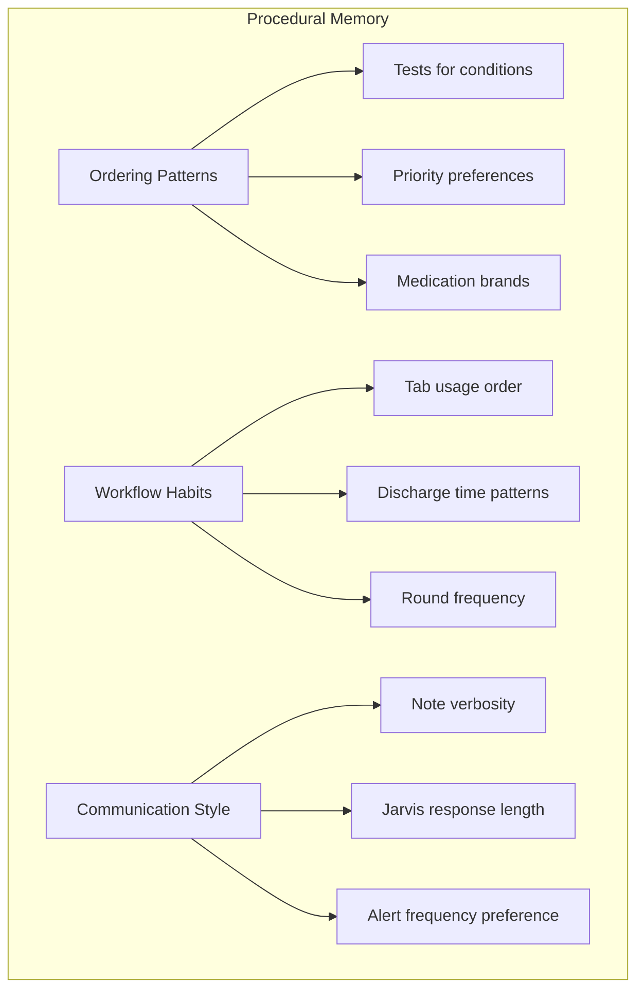
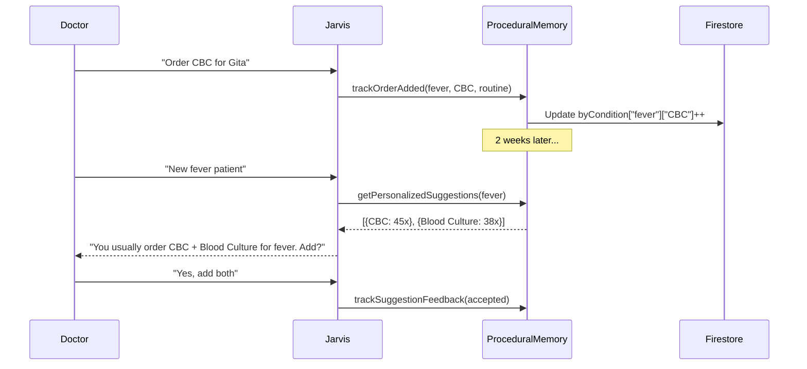
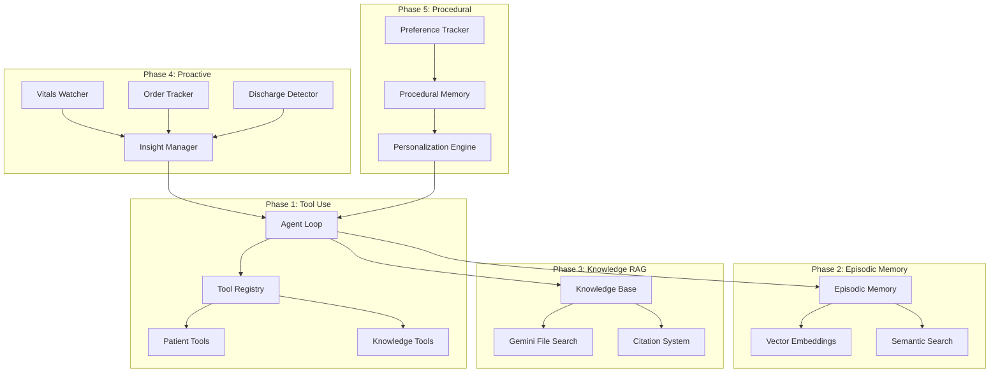

# Phase 5: Procedural Memory — ULTRATHINK Implementation Plan

> **Objective:** Enable Jarvis to learn each doctor's preferences, habits, and workflow patterns to provide personalized suggestions.

---

## 1. Executive Summary

| Attribute | Value |
|---|---|
| **Scope** | Learn and apply doctor-specific ordering patterns and preferences |
| **Dependencies** | Phase 1 (Tool Use), Firestore (existing) |
| **New Files** | 3 new TypeScript files |
| **Modified Files** | 2 existing files |
| **Estimated Effort** | 2 days |
| **Risk Level** | Low (additive, non-breaking) |

---

## 2. ULTRATHINK: Why Procedural Memory Matters

### 2.1 The Personalization Gap

| Scenario | Generic Jarvis | Jarvis with Procedural Memory |
|---|---|---|
| Fever workup | Suggests CBC, CRP | ✅ "Dr. S, you usually order CBC + Blood Culture + Procalcitonin for fever. Should I add those?" |
| Medication preference | Generic drug | ✅ "You prefer Paracetamol IV over PO for acute fever." |
| Documentation style | Template | ✅ "Based on your past notes, you prefer bullet-point assessments." |
| Order priority | Random | ✅ "You mark sepsis workups as STAT 90% of the time." |

### 2.2 Procedural Memory vs. Episodic Memory

| Aspect | Episodic (Phase 2) | Procedural (Phase 5) |
|---|---|---|
| Type | Specific events | Patterns/habits |
| Example | "On Jan 5th, you ordered CBC for Gita" | "You order CBC for 85% of fever patients" |
| Storage | Full interaction records | Aggregated statistics |
| Use | Recall specific past | Personalize future suggestions |

---

## 3. Preference Categories



---

## 4. Data Model Design

### 4.1 Preference Schema

```typescript
interface DoctorPreferences {
    doctorId: string;
    doctorName: string;
    
    // Ordering Patterns
    orderingPatterns: {
        // condition -> { order -> count }
        byCondition: Record<string, Record<string, number>>;
        // e.g., { "fever": { "CBC": 45, "Blood Culture": 38, "Procalcitonin": 22 } }
        
        priorityPatterns: Record<string, Record<string, number>>;
        // e.g., { "sepsis_workup": { "STAT": 12, "urgent": 2, "routine": 1 } }
        
        preferredBrands: Record<string, string>;
        // e.g., { "Paracetamol": "Crocin", "Pantoprazole": "Pan 40" }
    };
    
    // Suggestion Feedback
    suggestionFeedback: {
        accepted: number;
        rejected: number;
        modified: number;
        // by category
        byCategory: Record<string, { accepted: number; rejected: number }>;
    };
    
    // Workflow Preferences
    workflowPreferences: {
        preferredResponseLength: 'concise' | 'detailed' | 'auto';
        alertThreshold: number;  // 0-1, higher = fewer alerts
        preferredTabs: string[]; // Tab visit order
    };
    
    // Timestamps
    lastUpdated: string;
    createdAt: string;
    totalInteractions: number;
}
```

### 4.2 Firestore Structure

```
firestore/
└── doctor_preferences/
    └── {doctorId}: DoctorPreferences
```

---

## 5. File-Level Implementation Plan

### 5.1 New Files

```
services/
└── jarvis/
    └── memory/
        ├── ProceduralMemory.ts    # Core preference learning/retrieval
        ├── PreferenceTracker.ts   # Event tracking and aggregation
        └── PersonalizationEngine.ts # Apply preferences to suggestions
```

---

### 5.2 Detailed File Specifications

#### **File 1: `services/jarvis/memory/ProceduralMemory.ts`**

```typescript
import { db, isFirebaseInitialized } from '../../firebase';
import { doc, getDoc, setDoc, updateDoc } from 'firebase/firestore';

export interface DoctorPreferences {
    doctorId: string;
    doctorName: string;
    orderingPatterns: {
        byCondition: Record<string, Record<string, number>>;
        priorityPatterns: Record<string, Record<string, number>>;
        preferredBrands: Record<string, string>;
    };
    suggestionFeedback: {
        accepted: number;
        rejected: number;
        modified: number;
        byCategory: Record<string, { accepted: number; rejected: number }>;
    };
    workflowPreferences: {
        preferredResponseLength: 'concise' | 'detailed' | 'auto';
        alertThreshold: number;
        preferredTabs: string[];
    };
    lastUpdated: string;
    createdAt: string;
    totalInteractions: number;
}

const DEFAULT_PREFERENCES: Omit<DoctorPreferences, 'doctorId' | 'doctorName' | 'createdAt'> = {
    orderingPatterns: {
        byCondition: {},
        priorityPatterns: {},
        preferredBrands: {},
    },
    suggestionFeedback: {
        accepted: 0,
        rejected: 0,
        modified: 0,
        byCategory: {},
    },
    workflowPreferences: {
        preferredResponseLength: 'auto',
        alertThreshold: 0.5,
        preferredTabs: [],
    },
    lastUpdated: new Date().toISOString(),
    totalInteractions: 0,
};

/**
 * Get or create doctor preferences
 */
export async function getPreferences(doctorId: string, doctorName: string): Promise<DoctorPreferences> {
    if (!isFirebaseInitialized || !db) {
        return {
            doctorId,
            doctorName,
            ...DEFAULT_PREFERENCES,
            createdAt: new Date().toISOString(),
        };
    }
    
    try {
        const docRef = doc(db, 'doctor_preferences', doctorId);
        const snapshot = await getDoc(docRef);
        
        if (snapshot.exists()) {
            return snapshot.data() as DoctorPreferences;
        }
        
        // Create new
        const newPrefs: DoctorPreferences = {
            doctorId,
            doctorName,
            ...DEFAULT_PREFERENCES,
            createdAt: new Date().toISOString(),
        };
        await setDoc(docRef, newPrefs);
        return newPrefs;
        
    } catch (error) {
        console.error('[ProceduralMemory] getPreferences error:', error);
        return { doctorId, doctorName, ...DEFAULT_PREFERENCES, createdAt: new Date().toISOString() };
    }
}

/**
 * Update preferences (partial update)
 */
export async function updatePreferences(
    doctorId: string,
    updates: Partial<DoctorPreferences>
): Promise<void> {
    if (!isFirebaseInitialized || !db) return;
    
    try {
        const docRef = doc(db, 'doctor_preferences', doctorId);
        await updateDoc(docRef, {
            ...updates,
            lastUpdated: new Date().toISOString(),
        });
    } catch (error) {
        console.error('[ProceduralMemory] updatePreferences error:', error);
    }
}

/**
 * Record an order pattern
 */
export async function recordOrderPattern(
    doctorId: string,
    condition: string,
    orderLabel: string,
    priority: string
): Promise<void> {
    const prefs = await getPreferences(doctorId, '');
    
    // Update condition -> order count
    const byCondition = prefs.orderingPatterns.byCondition;
    if (!byCondition[condition]) byCondition[condition] = {};
    byCondition[condition][orderLabel] = (byCondition[condition][orderLabel] || 0) + 1;
    
    // Update priority patterns
    const priorityPatterns = prefs.orderingPatterns.priorityPatterns;
    const conditionKey = `${condition}:${orderLabel}`;
    if (!priorityPatterns[conditionKey]) priorityPatterns[conditionKey] = {};
    priorityPatterns[conditionKey][priority] = (priorityPatterns[conditionKey][priority] || 0) + 1;
    
    await updatePreferences(doctorId, {
        orderingPatterns: { ...prefs.orderingPatterns, byCondition, priorityPatterns },
        totalInteractions: prefs.totalInteractions + 1,
    });
}

/**
 * Record suggestion feedback
 */
export async function recordFeedback(
    doctorId: string,
    category: string,
    outcome: 'accepted' | 'rejected' | 'modified'
): Promise<void> {
    const prefs = await getPreferences(doctorId, '');
    
    const feedback = prefs.suggestionFeedback;
    feedback[outcome]++;
    
    if (!feedback.byCategory[category]) {
        feedback.byCategory[category] = { accepted: 0, rejected: 0 };
    }
    if (outcome === 'accepted') {
        feedback.byCategory[category].accepted++;
    } else if (outcome === 'rejected') {
        feedback.byCategory[category].rejected++;
    }
    
    await updatePreferences(doctorId, { suggestionFeedback: feedback });
}

/**
 * Get top orders for a condition
 */
export function getTopOrdersForCondition(
    prefs: DoctorPreferences,
    condition: string,
    limit: number = 5
): { order: string; count: number }[] {
    const conditionOrders = prefs.orderingPatterns.byCondition[condition] || {};
    
    return Object.entries(conditionOrders)
        .map(([order, count]) => ({ order, count }))
        .sort((a, b) => b.count - a.count)
        .slice(0, limit);
}

/**
 * Get preferred priority for an order
 */
export function getPreferredPriority(
    prefs: DoctorPreferences,
    condition: string,
    orderLabel: string
): string {
    const key = `${condition}:${orderLabel}`;
    const priorities = prefs.orderingPatterns.priorityPatterns[key] || {};
    
    if (Object.keys(priorities).length === 0) return 'routine';
    
    return Object.entries(priorities)
        .sort((a, b) => b[1] - a[1])[0][0];
}

/**
 * Calculate acceptance rate for a category
 */
export function getAcceptanceRate(
    prefs: DoctorPreferences,
    category?: string
): number {
    if (category) {
        const cat = prefs.suggestionFeedback.byCategory[category];
        if (!cat) return 0.5;
        const total = cat.accepted + cat.rejected;
        return total > 0 ? cat.accepted / total : 0.5;
    }
    
    const total = prefs.suggestionFeedback.accepted + prefs.suggestionFeedback.rejected;
    return total > 0 ? prefs.suggestionFeedback.accepted / total : 0.5;
}
```

---

#### **File 2: `services/jarvis/memory/PreferenceTracker.ts`**

```typescript
import { recordOrderPattern, recordFeedback } from './ProceduralMemory';
import { Patient, Order } from '../../../types';

/**
 * Track when a doctor adds an order
 */
export function trackOrderAdded(
    doctorId: string,
    patient: Patient,
    order: Order
): void {
    // Extract condition from chief complaint or active problems
    const condition = extractCondition(patient);
    
    recordOrderPattern(
        doctorId,
        condition,
        order.label,
        order.priority || 'routine'
    );
}

/**
 * Track suggestion feedback
 */
export function trackSuggestionFeedback(
    doctorId: string,
    category: string,
    wasAccepted: boolean,
    wasModified: boolean = false
): void {
    const outcome = wasModified ? 'modified' : (wasAccepted ? 'accepted' : 'rejected');
    recordFeedback(doctorId, category, outcome);
}

/**
 * Extract primary condition from patient data
 */
function extractCondition(patient: Patient): string {
    // Try chief complaint
    if (patient.chiefComplaints?.[0]?.complaint) {
        return normalizeCondition(patient.chiefComplaints[0].complaint);
    }
    
    // Try active problems
    if (patient.activeProblems?.[0]?.description) {
        return normalizeCondition(patient.activeProblems[0].description);
    }
    
    // Try triage reason
    if (patient.triage?.reasons?.[0]) {
        return normalizeCondition(patient.triage.reasons[0]);
    }
    
    return 'general';
}

/**
 * Normalize condition string for consistent matching
 */
function normalizeCondition(condition: string): string {
    const lower = condition.toLowerCase();
    
    // Map common variations to canonical forms
    const mappings: Record<string, string> = {
        'fever': 'fever',
        'pyrexia': 'fever',
        'high temperature': 'fever',
        'chest pain': 'chest_pain',
        'angina': 'chest_pain',
        'shortness of breath': 'dyspnea',
        'sob': 'dyspnea',
        'breathlessness': 'dyspnea',
        'abdominal pain': 'abdominal_pain',
        'stomach pain': 'abdominal_pain',
        'headache': 'headache',
        'cephalgia': 'headache',
        'diabetes': 'diabetes',
        'dm': 'diabetes',
        'hypertension': 'hypertension',
        'htn': 'hypertension',
        'high bp': 'hypertension',
    };
    
    for (const [key, value] of Object.entries(mappings)) {
        if (lower.includes(key)) return value;
    }
    
    // Default: first two words, lowercase, underscored
    return lower.split(' ').slice(0, 2).join('_').replace(/[^a-z_]/g, '');
}
```

---

#### **File 3: `services/jarvis/memory/PersonalizationEngine.ts`**

```typescript
import { DoctorPreferences, getPreferences, getTopOrdersForCondition, getPreferredPriority, getAcceptanceRate } from './ProceduralMemory';
import { Patient, Order } from '../../../types';

interface PersonalizedSuggestion {
    order: string;
    category: string;
    priority: string;
    confidence: number;
    reason: string;
}

/**
 * Generate personalized order suggestions based on doctor's history
 */
export async function getPersonalizedSuggestions(
    doctorId: string,
    doctorName: string,
    patient: Patient
): Promise<PersonalizedSuggestion[]> {
    const prefs = await getPreferences(doctorId, doctorName);
    const condition = extractConditionFromPatient(patient);
    
    // Not enough data yet
    if (prefs.totalInteractions < 10) {
        return [];
    }
    
    const topOrders = getTopOrdersForCondition(prefs, condition, 5);
    
    return topOrders.map(({ order, count }) => {
        const priority = getPreferredPriority(prefs, condition, order);
        const category = inferCategory(order);
        
        return {
            order,
            category,
            priority,
            confidence: Math.min(count / 20, 0.95),  // Cap at 0.95
            reason: `You've ordered this ${count} times for similar cases.`
        };
    });
}

/**
 * Personalize Jarvis response style
 */
export function getResponseStyle(prefs: DoctorPreferences): {
    length: 'concise' | 'detailed';
    includeRationale: boolean;
} {
    const style = prefs.workflowPreferences.preferredResponseLength;
    
    if (style === 'auto') {
        // Infer from acceptance rate: higher acceptance = trusts Jarvis = can be concise
        const acceptRate = getAcceptanceRate(prefs);
        return {
            length: acceptRate > 0.7 ? 'concise' : 'detailed',
            includeRationale: acceptRate < 0.6  // Include more explanation if low trust
        };
    }
    
    return {
        length: style as 'concise' | 'detailed',
        includeRationale: style === 'detailed'
    };
}

/**
 * Get personalized alert threshold
 */
export function getAlertThreshold(prefs: DoctorPreferences): number {
    return prefs.workflowPreferences.alertThreshold;
}

/**
 * Format personalization context for agent prompt
 */
export function formatPersonalizationContext(prefs: DoctorPreferences, condition: string): string {
    const topOrders = getTopOrdersForCondition(prefs, condition, 3);
    const acceptRate = getAcceptanceRate(prefs);
    
    if (topOrders.length === 0) return '';
    
    const orderList = topOrders.map(o => `${o.order} (${o.count}x)`).join(', ');
    
    return `
--- Doctor Preferences ---
For "${condition}" cases, this doctor typically orders: ${orderList}
Suggestion acceptance rate: ${(acceptRate * 100).toFixed(0)}%
${acceptRate > 0.8 ? 'This doctor trusts AI suggestions - be concise.' : 'Include clear rationale for suggestions.'}
--- End Preferences ---
`;
}

// Helper functions
function extractConditionFromPatient(patient: Patient): string {
    if (patient.chiefComplaints?.[0]?.complaint) {
        return patient.chiefComplaints[0].complaint.toLowerCase().split(' ').slice(0, 2).join('_');
    }
    return 'general';
}

function inferCategory(orderLabel: string): string {
    const lower = orderLabel.toLowerCase();
    if (lower.includes('cbc') || lower.includes('blood') || lower.includes('panel')) return 'investigation';
    if (lower.includes('ct') || lower.includes('mri') || lower.includes('x-ray')) return 'radiology';
    if (lower.includes('mg') || lower.includes('ml') || lower.includes('tab')) return 'medication';
    return 'investigation';
}
```

---

### 5.3 Modified Files

#### **Modify: `services/jarvis/agent/AgentLoop.ts`**

Add personalization context to system prompt:

```typescript
import { getPreferences } from '../memory/ProceduralMemory';
import { formatPersonalizationContext, getResponseStyle } from '../memory/PersonalizationEngine';

// Inside buildContext():
const prefs = await getPreferences(context.currentUser.id, context.currentUser.name);
const condition = context.currentPatient?.chiefComplaints?.[0]?.complaint || 'general';
const personalizationContext = formatPersonalizationContext(prefs, condition);
const responseStyle = getResponseStyle(prefs);

const enhancedSystemPrompt = `${systemPrompt}
${personalizationContext}
Response style: ${responseStyle.length}${responseStyle.includeRationale ? ' with rationale' : ''}
`;
```

#### **Modify: `services/jarvis/proactive/InsightManager.ts`**

Use personalized alert threshold:

```typescript
import { getPreferences, getAlertThreshold } from '../memory/ProceduralMemory';

// In addInsight():
addInsight(insight, doctorId) {
    const prefs = await getPreferences(doctorId, '');
    const threshold = getAlertThreshold(prefs);
    
    if (insight.priority < threshold) {
        return false;  // Below doctor's preferred threshold
    }
    // ... rest of logic
}
```

---

## 6. Learning Loop Visualization



---

## 7. Privacy & Control

| Feature | Implementation |
|---|---|
| **Opt-out** | Doctor can disable personalization in settings |
| **Reset** | "Forget my preferences" button clears all data |
| **Transparency** | "Why this suggestion?" shows historical basis |
| **Per-doctor isolation** | Data never shared between doctors |

---

## 8. Testing Strategy

### 8.1 Unit Tests

```typescript
describe('ProceduralMemory', () => {
    it('tracks order patterns correctly', async () => {
        await recordOrderPattern('doc1', 'fever', 'CBC', 'routine');
        await recordOrderPattern('doc1', 'fever', 'CBC', 'routine');
        await recordOrderPattern('doc1', 'fever', 'Blood Culture', 'routine');
        
        const prefs = await getPreferences('doc1', 'Dr. Test');
        const top = getTopOrdersForCondition(prefs, 'fever', 2);
        
        expect(top[0].order).toBe('CBC');
        expect(top[0].count).toBe(2);
    });

    it('calculates acceptance rate', async () => {
        await recordFeedback('doc1', 'investigation', 'accepted');
        await recordFeedback('doc1', 'investigation', 'accepted');
        await recordFeedback('doc1', 'investigation', 'rejected');
        
        const prefs = await getPreferences('doc1', 'Dr. Test');
        const rate = getAcceptanceRate(prefs, 'investigation');
        
        expect(rate).toBeCloseTo(0.67, 1);
    });
});
```

---

## 9. Rollback Procedure

1.  **Immediate:** Skip personalization context in `AgentLoop.ts`
2.  **Data:** Firestore data remains but unused
3.  **UI:** Remove "Why this suggestion?" tooltips

---

## 10. Success Metrics

| Metric | Target | Measurement |
|---|---|---|
| Personalization rate | >50% of suggestions use history | Log personalized vs. generic |
| Acceptance rate improvement | +10% vs. generic | Compare before/after |
| Time per order | -20% with suggestions | Measure order completion time |
| Doctor satisfaction | >4/5 rating | Periodic survey |

---

## 11. Acceptance Criteria

- [ ] Order patterns are tracked and persisted
- [ ] Suggestions include "You usually order..." context
- [ ] Acceptance rate calculated correctly
- [ ] Personalization context injected into agent prompt
- [ ] Alert threshold is personalized per doctor
- [ ] "Reset preferences" functionality works
- [ ] Unit tests pass

---

## 12. Phase Summary: Jarvis 2.0 Complete Architecture



This completes the full Jarvis 2.0 Super Agent architecture!
